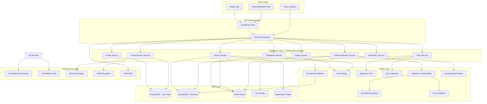
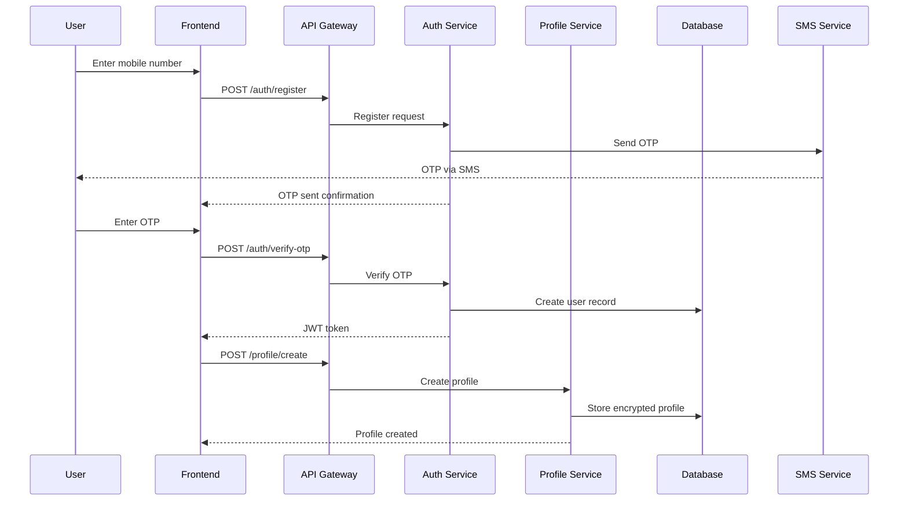
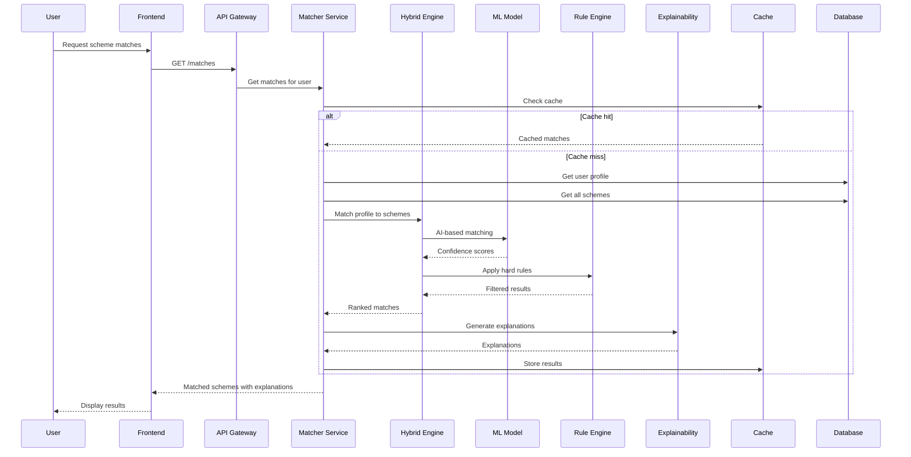
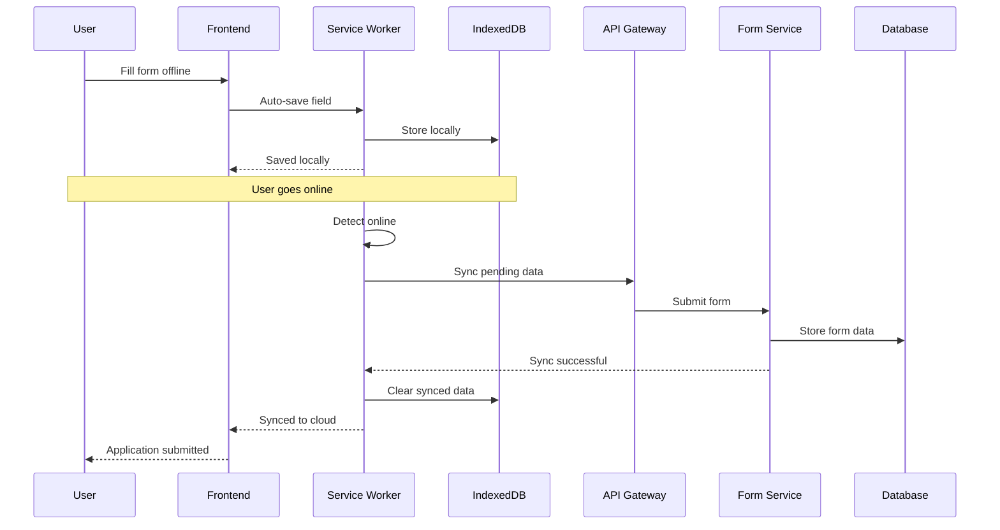
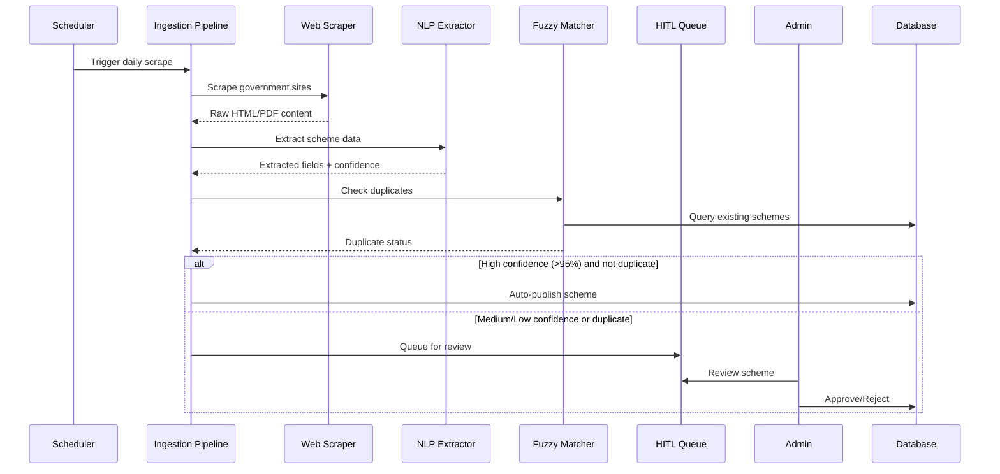

# Design Document: Sahaayak AI

## Overview

Sahaayak AI is a cloud-native, AI-powered multilingual public scheme navigator designed to help Indian citizens discover and understand government schemes they're eligible for. The system employs a hybrid AI + rule-based architecture deployed on AWS, with voice-first interaction, multilingual NLP capabilities, and aggressive optimization for low-bandwidth environments to serve rural and underserved communities.

The design prioritizes accessibility, performance, and scalability to serve millions of users across diverse linguistic, literacy, and connectivity contexts. The platform uses a microservices architecture with Progressive Web App (PWA) frontend, Lambda-based serverless backend, and an AI-powered scheme ingestion pipeline for automatic database updates.

## Architecture

### High-Level Architecture

The Sahaayak AI platform is built on a five-layer architecture:

1. **Client Layer**: Progressive Web App (PWA) with mobile-first design, voice interface, and offline-first capabilities
2. **API Gateway Layer**: AWS API Gateway with CloudFront CDN for global content delivery and request routing
3. **Application Layer**: Lambda-based microservices for authentication, profile management, scheme matching, search, translation, voice processing, and notifications
4. **AI/ML Layer**: Hybrid AI + rule-based eligibility engine, NLP for multilingual understanding, speech-to-text, text-to-speech, and AI-powered scheme ingestion pipeline
5. **Data Layer**: PostgreSQL for user data, DynamoDB for scheme database, Redis for caching, S3 for storage
6. **Infrastructure Layer**: AWS cloud services with auto-scaling, multi-region deployment, monitoring, and security



### Architecture Principles

1. **Microservices**: Independent services for scalability and maintainability
2. **API-First**: All functionality exposed via RESTful APIs
3. **Cloud-Native**: Leverages AWS managed services for reliability
4. **Caching Strategy**: Aggressive caching for performance and bandwidth optimization
5. **Async Processing**: Non-blocking operations for better user experience
6. **Multi-Region**: Deployed across multiple AWS regions for low latency

### Technology Stack

- **Frontend**: React.js with Progressive Web App (PWA) capabilities
- **API Gateway**: AWS API Gateway with request throttling and caching
- **Backend Services**: Node.js with Express.js (for I/O-bound operations)
- **ML Services**: Python with FastAPI (for AI/ML workloads)
- **Databases**: 
  - Amazon RDS PostgreSQL (user profiles, transactional data)
  - Amazon DynamoDB (scheme database, high-read workload)
- **Caching**: Amazon ElastiCache (Redis)
- **Storage**: Amazon S3 (voice recordings, static assets)
- **CDN**: Amazon CloudFront (global content delivery)
- **ML Platform**: Amazon SageMaker (model training and deployment)
- **Voice Services**: Amazon Polly (TTS), Amazon Transcribe (STT)
- **Translation**: Amazon Translate with custom terminology
- **Monitoring**: Amazon CloudWatch, AWS X-Ray
- **Authentication**: AWS Cognito with OTP via Amazon SNS

## Components and Interfaces

### 1. Authentication Service

**Responsibility**: User registration, login, session management, and authorization.

**Interfaces**:

```typescript
interface AuthService {
  // Register new user with mobile number
  registerUser(mobileNumber: string, language: string): Promise<{userId: string, otpSent: boolean}>
  
  // Verify OTP and complete registration
  verifyOTP(userId: string, otp: string): Promise<{token: string, expiresAt: number}>
  
  // Login with mobile number
  login(mobileNumber: string): Promise<{otpSent: boolean}>
  
  // Verify login OTP
  verifyLoginOTP(mobileNumber: string, otp: string): Promise<{token: string, userId: string}>
  
  // Refresh authentication token
  refreshToken(token: string): Promise<{newToken: string, expiresAt: number}>
  
  // Logout and invalidate session
  logout(token: string): Promise<{success: boolean}>
  
  // Validate token for authorization
  validateToken(token: string): Promise<{valid: boolean, userId: string}>
}
```

**Implementation Details**:
- Uses AWS Cognito for user pool management
- OTP delivery via Amazon SNS
- JWT tokens with 30-minute expiration
- Failed login attempts tracked in Redis with 15-minute lockout after 3 failures
- Session data stored in Redis for fast validation

### 2. Profile Service

**Responsibility**: Manage user profile data including demographics and preferences.

**Interfaces**:

```typescript
interface UserProfile {
  userId: string
  mobileNumber: string
  age: number
  gender: 'male' | 'female' | 'other'
  state: string
  district: string
  annualIncome: number
  occupation: string
  category: 'general' | 'obc' | 'sc' | 'st' | 'ews'
  householdSize: number
  hasDisability: boolean
  preferredLanguage: string
  notificationPreferences: NotificationPreferences
  createdAt: Date
  updatedAt: Date
}

interface NotificationPreferences {
  smsEnabled: boolean
  emailEnabled: boolean
  inAppEnabled: boolean
  frequency: 'immediate' | 'daily' | 'weekly'
}

interface ProfileService {
  // Create new user profile
  createProfile(userId: string, profile: Partial<UserProfile>): Promise<UserProfile>
  
  // Get user profile by ID
  getProfile(userId: string): Promise<UserProfile>
  
  // Update user profile
  updateProfile(userId: string, updates: Partial<UserProfile>): Promise<UserProfile>
  
  // Delete user profile and all associated data
  deleteProfile(userId: string): Promise<{success: boolean}>
  
  // Validate profile data against constraints
  validateProfileData(profile: Partial<UserProfile>): Promise<{valid: boolean, errors: string[]}>
}
```

**Implementation Details**:
- Stores data in Amazon RDS PostgreSQL with encryption at rest
- Profile data encrypted using AES-256
- Implements data validation rules (age 0-120, income >= 0, etc.)
- Audit log for all profile changes stored separately
- Supports partial updates to minimize data transfer

### 3. Scheme Matcher Service

**Responsibility**: AI-powered matching of users to eligible government schemes.

**Interfaces**:

```typescript
interface SchemeMatch {
  schemeId: string
  schemeName: string
  confidenceScore: number // 0-100
  eligibilityStatus: 'eligible' | 'partially_eligible' | 'not_eligible'
  matchReasons: string[]
  estimatedBenefit: number
  priority: number
}

interface MatcherService {
  // Find matching schemes for a user profile
  findMatches(userId: string): Promise<SchemeMatch[]>
  
  // Get detailed match explanation
  getMatchExplanation(userId: string, schemeId: string): Promise<{
    eligible: boolean
    matchedCriteria: string[]
    unmatchedCriteria: string[]
    missingDocuments: string[]
  }>
  
  // Suggest profile improvements for better matches
  suggestProfileImprovements(userId: string): Promise<{
    suggestions: string[]
    potentialNewMatches: number
  }>
  
  // Re-rank matches based on user preferences
  rankMatches(matches: SchemeMatch[], preferences: RankingPreferences): SchemeMatch[]
}

interface RankingPreferences {
  prioritizeBenefit: boolean
  preferredCategories: string[]
  urgencyLevel: 'high' | 'medium' | 'low'
}
```

**Implementation Details**:
- ML model trained on historical scheme eligibility data
- Feature engineering from user profile: age_group, income_bracket, location_tier, etc.
- Model: Gradient Boosting (XGBoost) for classification
- Features: 25+ engineered features from profile and scheme criteria
- Model deployed on Amazon SageMaker with auto-scaling
- Confidence score based on model probability and rule-based validation
- Results cached in Redis for 24 hours per user
- Batch inference for multiple schemes in single API call

**Matching Algorithm**:
1. Extract user features from profile
2. Query all active schemes from database
3. Run ML model inference for each scheme
4. Apply rule-based filters for hard constraints (age limits, location, etc.)
5. Calculate confidence scores combining ML probability and rule matches
6. Rank by confidence score and estimated benefit
7. Return top N matches (default: 20)

### 4. Search Service

**Responsibility**: Keyword-based scheme search with multilingual support.

**Interfaces**:

```typescript
interface SearchResult {
  schemeId: string
  schemeName: string
  description: string
  relevanceScore: number
  highlights: string[]
}

interface SearchService {
  // Search schemes by keywords
  searchSchemes(query: string, language: string, filters?: SearchFilters): Promise<SearchResult[]>
  
  // Get search suggestions as user types
  getSuggestions(partialQuery: string, language: string): Promise<string[]>
  
  // Get related schemes
  getRelatedSchemes(schemeId: string, limit: number): Promise<SearchResult[]>
}

interface SearchFilters {
  category?: string[]
  benefitType?: string[]
  targetDemographic?: string[]
  state?: string
}
```

**Implementation Details**:
- Uses Amazon OpenSearch Service for full-text search
- Multilingual search with language-specific analyzers
- Synonym expansion for common terms (e.g., "farmer" → "किसान", "ryot")
- TF-IDF scoring with boosting for scheme name matches
- Search index updated every hour from scheme database
- Query results cached in Redis for 1 hour
- Automatic language detection using character set analysis

### 5. Translation Service

**Responsibility**: Translate content between supported languages.

**Interfaces**:

```typescript
interface TranslationService {
  // Translate text to target language
  translate(text: string, targetLanguage: string, sourceLanguage?: string): Promise<string>
  
  // Batch translate multiple texts
  batchTranslate(texts: string[], targetLanguage: string): Promise<string[]>
  
  // Translate with terminology preservation
  translateWithTerms(text: string, targetLanguage: string, preserveTerms: string[]): Promise<string>
  
  // Detect language of text
  detectLanguage(text: string): Promise<string>
}
```

**Implementation Details**:
- Uses Amazon Translate with custom terminology
- Custom terminology for government scheme names and technical terms
- Translation cache in Redis (key: hash of text + target language)
- Cache TTL: 7 days for scheme content, 1 day for UI text
- Fallback to English if translation fails
- Preserves formatting and special characters

### 6. Voice Service

**Responsibility**: Speech-to-text and text-to-speech conversion.

**Interfaces**:

```typescript
interface VoiceService {
  // Convert speech to text
  speechToText(audioData: Buffer, language: string): Promise<{
    text: string
    confidence: number
  }>
  
  // Convert text to speech
  textToSpeech(text: string, language: string, voiceGender?: 'male' | 'female'): Promise<{
    audioUrl: string
    duration: number
  }>
  
  // Process voice command
  processVoiceCommand(audioData: Buffer, language: string): Promise<{
    command: string
    parameters: Record<string, any>
  }>
}
```

**Implementation Details**:
- Amazon Transcribe for STT with language-specific models
- Amazon Polly for TTS with neural voices
- Audio files stored in S3 with 24-hour expiration
- Streaming support for real-time voice interaction
- Voice command parser for navigation ("next", "back", "repeat", "help")
- Minimum 85% confidence threshold for STT acceptance
- Audio compression (Opus codec) for bandwidth optimization

### 7. Notification Service

**Responsibility**: Send notifications via multiple channels.

**Interfaces**:

```typescript
interface NotificationService {
  // Send notification to user
  sendNotification(userId: string, notification: Notification): Promise<{sent: boolean}>
  
  // Send bulk notifications
  sendBulkNotifications(userIds: string[], notification: Notification): Promise<{
    sent: number
    failed: number
  }>
  
  // Schedule notification for future delivery
  scheduleNotification(userId: string, notification: Notification, sendAt: Date): Promise<{
    notificationId: string
  }>
  
  // Get notification history
  getNotificationHistory(userId: string, limit: number): Promise<Notification[]>
}

interface Notification {
  type: 'new_scheme' | 'deadline_reminder' | 'eligibility_change' | 'system_update'
  title: string
  message: string
  channels: ('sms' | 'email' | 'in_app')[]
  priority: 'high' | 'medium' | 'low'
  actionUrl?: string
}
```

**Implementation Details**:
- Amazon SNS for SMS delivery
- Amazon SES for email delivery
- In-app notifications stored in DynamoDB
- Respects user notification preferences
- Rate limiting: max 5 notifications per day per user
- Scheduled notifications using Amazon EventBridge
- Delivery status tracking and retry logic

### 8. Scheme Database Service

**Responsibility**: Manage government scheme data.

**Interfaces**:

```typescript
interface Scheme {
  schemeId: string
  schemeName: string
  description: string
  benefits: string
  eligibilityCriteria: EligibilityCriteria
  applicationProcess: ApplicationStep[]
  requiredDocuments: string[]
  contactInfo: ContactInfo
  category: string
  benefitType: string
  targetDemographic: string[]
  state: string
  isActive: boolean
  createdAt: Date
  updatedAt: Date
}

interface EligibilityCriteria {
  minAge?: number
  maxAge?: number
  minIncome?: number
  maxIncome?: number
  allowedStates?: string[]
  allowedCategories?: string[]
  requiredOccupations?: string[]
  otherCriteria?: Record<string, any>
}

interface ApplicationStep {
  stepNumber: number
  description: string
  estimatedTime: number // minutes
  isOnline: boolean
}

interface ContactInfo {
  phone: string[]
  email: string[]
  officeAddress: string
  website?: string
}

interface SchemeService {
  // Get scheme by ID
  getScheme(schemeId: string, language?: string): Promise<Scheme>
  
  // Get all active schemes
  getAllSchemes(filters?: SchemeFilters): Promise<Scheme[]>
  
  // Create new scheme (admin only)
  createScheme(scheme: Scheme): Promise<{schemeId: string}>
  
  // Update scheme (admin only)
  updateScheme(schemeId: string, updates: Partial<Scheme>): Promise<Scheme>
  
  // Deactivate scheme (admin only)
  deactivateScheme(schemeId: string): Promise<{success: boolean}>
  
  // Bulk import schemes (admin only)
  bulkImportSchemes(schemes: Scheme[]): Promise<{
    imported: number
    failed: number
    errors: string[]
  }>
}

interface SchemeFilters {
  category?: string
  state?: string
  isActive?: boolean
}
```

**Implementation Details**:
- Stored in Amazon DynamoDB for high-read performance
- Partition key: schemeId, GSI on state and category
- Scheme content cached in Redis for 24 hours
- Version history maintained in separate table
- Admin interface for CRUD operations
- Bulk import supports CSV and JSON formats
- Validation rules for required fields and data types

### 9. AI-Powered Scheme Ingestion Pipeline

**Responsibility**: Automatically scrape, extract, and update scheme information from government sources.

**Interfaces**:

```typescript
interface IngestionPipeline {
  // Scrape government websites for new schemes
  scrapeGovernmentSources(): Promise<{
    sourcesScraped: number
    schemesFound: number
    errors: string[]
  }>
  
  // Extract scheme details from scraped content
  extractSchemeData(rawContent: string, sourceUrl: string): Promise<{
    schemeData: Partial<Scheme>
    confidence: number
    extractedFields: string[]
  }>
  
  // Normalize extracted data to standard schema
  normalizeSchemeData(extractedData: Partial<Scheme>): Promise<Scheme>
  
  // Detect duplicate schemes using fuzzy matching
  detectDuplicates(newScheme: Scheme): Promise<{
    isDuplicate: boolean
    matchedSchemeId?: string
    similarity: number
  }>
  
  // Queue scheme for human verification
  queueForVerification(scheme: Scheme, confidence: number): Promise<{
    verificationId: string
    queuePosition: number
  }>
}
```

**Implementation Details**:
- Scheduled daily scraping using AWS Lambda with EventBridge triggers
- Web scraping using Puppeteer for dynamic content
- NLP-based extraction using fine-tuned BERT model for scheme entities
- Supports multiple formats: HTML, PDF (using pdf.js), JSON APIs
- Fuzzy matching using Levenshtein distance for duplicate detection
- Confidence scoring based on extraction quality (field completeness, data validity)
- Low confidence schemes (<80%) automatically queued for human review
- Extraction logs stored in S3 for audit and retraining
- Handles rate limiting and respects robots.txt

**Extraction Pipeline**:
1. Scrape government portals (daily at 2 AM IST)
2. Parse HTML/PDF content
3. Extract entities: scheme name, description, eligibility, benefits, deadlines
4. Normalize data (standardize formats, clean text)
5. Validate against schema
6. Check for duplicates
7. Calculate confidence score
8. High confidence (>95%): Auto-publish
9. Medium confidence (80-95%): Queue for review
10. Low confidence (<80%): Flag for manual entry

### 10. Human-in-the-Loop (HITL) Verification Module

**Responsibility**: Enable administrators to review and approve AI-extracted scheme data.

**Interfaces**:

```typescript
interface HITLVerification {
  // Get pending schemes for review
  getPendingSchemes(limit: number): Promise<PendingScheme[]>
  
  // Get scheme details with source for review
  getSchemeForReview(verificationId: string): Promise<{
    extractedData: Scheme
    sourceUrl: string
    sourceContent: string
    confidence: number
    lowConfidenceFields: string[]
  }>
  
  // Approve scheme and publish to live database
  approveScheme(verificationId: string, edits?: Partial<Scheme>): Promise<{
    schemeId: string
    published: boolean
  }>
  
  // Reject scheme with reason
  rejectScheme(verificationId: string, reason: string): Promise<{
    success: boolean
  }>
  
  // Bulk approve high-confidence schemes
  bulkApprove(verificationIds: string[]): Promise<{
    approved: number
    failed: number
  }>
  
  // Get verification metrics
  getVerificationMetrics(): Promise<{
    pendingCount: number
    approvalRate: number
    averageReviewTime: number
    topRejectionReasons: string[]
  }>
}

interface PendingScheme {
  verificationId: string
  schemeName: string
  confidence: number
  extractedAt: Date
  sourceUrl: string
  priority: 'high' | 'medium' | 'low'
}
```

**Implementation Details**:
- Admin dashboard built with React for review interface
- Side-by-side view: extracted data vs. original source
- Inline editing for corrections
- Keyboard shortcuts for fast review (Approve: A, Reject: R, Edit: E)
- Bulk actions for high-confidence schemes
- Approval workflow: Reviewer → Approver (two-step for critical schemes)
- Rejection feedback loop: reasons logged for model retraining
- SLA tracking: alert if pending queue exceeds 50 items
- Metrics dashboard: approval rate, review time, rejection patterns
- Audit trail for all verification actions

### 11. Offline-First Architecture & Sync Engine

**Responsibility**: Enable full functionality offline with automatic synchronization when online.

**Interfaces**:

```typescript
interface OfflineSync {
  // Check online/offline status
  getConnectionStatus(): Promise<{
    isOnline: boolean
    bandwidth: number // kbps
    latency: number // ms
  }>
  
  // Queue action for later sync
  queueAction(action: OfflineAction): Promise<{
    actionId: string
    queued: boolean
  }>
  
  // Sync all pending actions
  syncPendingActions(): Promise<{
    synced: number
    failed: number
    conflicts: SyncConflict[]
  }>
  
  // Get cached data for offline access
  getCachedData(key: string): Promise<any>
  
  // Update cache with new data
  updateCache(key: string, data: any, ttl: number): Promise<{
    cached: boolean
  }>
  
  // Resolve sync conflicts
  resolveConflict(conflict: SyncConflict, resolution: 'local' | 'remote' | 'merge'): Promise<{
    resolved: boolean
  }>
}

interface OfflineAction {
  type: 'profile_update' | 'search' | 'eligibility_check' | 'form_submission'
  data: any
  timestamp: number
  userId: string
}

interface SyncConflict {
  actionId: string
  localData: any
  remoteData: any
  conflictType: 'version_mismatch' | 'data_changed' | 'deleted'
}
```

**Implementation Details**:
- Service Worker for offline caching and background sync
- IndexedDB for local data storage (max 50 MB)
- Cache strategy:
  - Static assets: Cache-first
  - User profile: Network-first with cache fallback
  - Scheme data: Stale-while-revalidate
  - Search results: Network-only (cache for offline)
- Background Sync API for automatic sync when online
- Conflict resolution: Last-write-wins with user notification
- Sync queue persisted in IndexedDB
- Network status detection using Navigator.onLine and periodic ping
- Progressive enhancement: full features online, core features offline
- Offline indicator in UI with sync status

**Offline Capabilities**:
- View cached schemes (top 10 matches)
- View profile data
- Fill forms (saved locally)
- Voice input (processed when online)
- Search cached schemes
- View application status (last synced)

**Online-Only Features**:
- Real-time scheme matching
- New scheme discovery
- Application submission
- Notifications
- Admin functions

### 12. Household Profile Management

**Responsibility**: Manage profiles for multiple family members and household-level eligibility.

**Interfaces**:

```typescript
interface HouseholdProfile {
  householdId: string
  headOfHousehold: string // userId
  members: FamilyMember[]
  householdIncome: number
  address: Address
  createdAt: Date
  updatedAt: Date
}

interface FamilyMember {
  memberId: string
  name: string
  age: number
  gender: 'male' | 'female' | 'other'
  relationship: 'spouse' | 'child' | 'parent' | 'sibling' | 'other'
  educationLevel: string
  occupation?: string
  income?: number
  hasDisability: boolean
  disabilityType?: string
}

interface HouseholdService {
  // Create household profile
  createHousehold(userId: string, household: Partial<HouseholdProfile>): Promise<HouseholdProfile>
  
  // Add family member
  addMember(householdId: string, member: FamilyMember): Promise<{
    memberId: string
  }>
  
  // Update family member
  updateMember(householdId: string, memberId: string, updates: Partial<FamilyMember>): Promise<FamilyMember>
  
  // Remove family member
  removeMember(householdId: string, memberId: string): Promise<{
    success: boolean
  }>
  
  // Get household-level scheme matches
  getHouseholdMatches(householdId: string): Promise<{
    householdSchemes: SchemeMatch[]
    memberSchemes: Map<string, SchemeMatch[]> // memberId -> schemes
  }>
  
  // Calculate total household income
  calculateHouseholdIncome(householdId: string): Promise<number>
}
```

**Implementation Details**:
- Household data stored in PostgreSQL with foreign key to user
- Support up to 20 family members per household
- Automatic household income calculation from earning members
- Scheme matching considers both individual and household eligibility
- Results grouped by applicable member
- Dependent profiles inherit some attributes from head (address, state)
- Privacy: Only head of household can view/edit all members
- Validation: Age-appropriate fields (no income for children)

### 13. Assisted Application Flow with AI Voice Guidance

**Responsibility**: Provide step-by-step voice guidance for scheme applications.

**Interfaces**:

```typescript
interface ApplicationAssistant {
  // Start guided application
  startApplication(userId: string, schemeId: string): Promise<{
    applicationId: string
    steps: ApplicationStep[]
    currentStep: number
  }>
  
  // Get voice guidance for current step
  getVoiceGuidance(applicationId: string, stepNumber: number): Promise<{
    audioUrl: string
    transcript: string
    duration: number
  }>
  
  // Process voice input for form field
  processVoiceInput(applicationId: string, fieldName: string, audioData: Buffer): Promise<{
    extractedValue: any
    confidence: number
    needsConfirmation: boolean
  }>
  
  // Confirm user input via voice
  confirmInput(applicationId: string, fieldName: string, value: any): Promise<{
    confirmed: boolean
    audioUrl: string // Reads back the value
  }>
  
  // Get progress and remaining time
  getProgress(applicationId: string): Promise<{
    completedSteps: number
    totalSteps: number
    estimatedTimeRemaining: number // minutes
  }>
  
  // Pause and resume application
  pauseApplication(applicationId: string): Promise<{success: boolean}>
  resumeApplication(applicationId: string): Promise<{
    currentStep: number
    lastSaved: Date
  }>
}
```

**Implementation Details**:
- Voice guidance generated using Amazon Polly with SSML for natural speech
- Context-aware instructions based on user profile and scheme
- Field-level voice input with entity extraction
- Confirmation loop: read back user input for verification
- Progress tracking with visual and audio indicators
- Pause/resume functionality with auto-save
- Error correction: "That doesn't seem right, let's try again"
- Encouragement messages: "Great! You're halfway done"
- Document guidance: explains what each document is and where to get it
- Estimated time updates based on actual progress

### 14. Smart Forms with Auto-Save

**Responsibility**: Intelligent forms that work offline and save automatically.

**Interfaces**:

```typescript
interface SmartForm {
  // Initialize form with pre-filled data
  initializeForm(formType: string, userId: string): Promise<{
    formId: string
    fields: FormField[]
    preFilledData: Record<string, any>
  }>
  
  // Auto-save field value
  autoSaveField(formId: string, fieldName: string, value: any): Promise<{
    saved: boolean
    savedAt: Date
    syncStatus: 'local' | 'synced'
  }>
  
  // Get intelligent field suggestions
  getSuggestions(formId: string, fieldName: string, partialInput: string): Promise<string[]>
  
  // Validate field in real-time
  validateField(formId: string, fieldName: string, value: any): Promise<{
    valid: boolean
    errors: string[]
    suggestions: string[]
  }>
  
  // Submit form
  submitForm(formId: string): Promise<{
    submitted: boolean
    applicationId: string
    trackingId: string
  }>
  
  // Resume partially completed form
  resumeForm(formId: string): Promise<{
    fields: FormField[]
    completedFields: string[]
    lastSaved: Date
  }>
}

interface FormField {
  name: string
  label: string
  type: 'text' | 'number' | 'select' | 'date' | 'file'
  required: boolean
  validation: ValidationRule[]
  helpText: string
  suggestions?: string[]
}
```

**Implementation Details**:
- Auto-save after 2 seconds of inactivity per field
- Local storage in IndexedDB for offline capability
- Sync status indicator: "Saved locally" / "Synced to cloud"
- Intelligent suggestions from user profile and previous applications
- Real-time validation with helpful error messages
- Field dependencies: show/hide fields based on other values
- Progress bar showing completion percentage
- Resume from any device using cloud sync
- Conflict resolution: server version wins, notify user of changes
- Form versioning: handle schema changes gracefully

### 15. Real-Time Application Status Tracking

**Responsibility**: Track and display application status with government portal integration.

**Interfaces**:

```typescript
interface ApplicationTracking {
  // Submit application and get tracking ID
  submitApplication(userId: string, schemeId: string, formData: any): Promise<{
    applicationId: string
    trackingId: string
    submittedAt: Date
  }>
  
  // Get current application status
  getStatus(trackingId: string): Promise<ApplicationStatus>
  
  // Get status history
  getStatusHistory(trackingId: string): Promise<StatusChange[]>
  
  // Integrate with government portal for real-time updates
  syncWithGovernmentPortal(trackingId: string): Promise<{
    synced: boolean
    lastSyncAt: Date
  }>
  
  // Get all applications for user
  getUserApplications(userId: string): Promise<ApplicationStatus[]>
  
  // Upload pending documents
  uploadDocument(trackingId: string, documentType: string, file: Buffer): Promise<{
    uploaded: boolean
    documentId: string
  }>
}

interface ApplicationStatus {
  trackingId: string
  schemeId: string
  schemeName: string
  status: 'submitted' | 'under_review' | 'pending_documents' | 'approved' | 'rejected' | 'disbursed'
  submittedAt: Date
  lastUpdated: Date
  estimatedProcessingTime: number // days
  pendingDocuments?: string[]
  rejectionReason?: string
  contactInfo: ContactInfo
  nextSteps: string[]
}

interface StatusChange {
  status: string
  timestamp: Date
  notes?: string
  updatedBy: string
}
```

**Implementation Details**:
- Unique tracking ID generated using UUID
- Status stored in DynamoDB with GSI on userId
- Real-time updates via WebSocket (AWS API Gateway WebSocket)
- Government portal integration using APIs where available
- Fallback: Manual status updates by admin
- SMS and in-app notifications on status changes
- Estimated processing time based on historical data
- Document upload to S3 with virus scanning
- Status history for transparency and audit
- Reapplication guidance for rejected applications

### 16. Explainable AI Engine

**Responsibility**: Provide human-readable explanations for eligibility decisions.

**Interfaces**:

```typescript
interface ExplainabilityEngine {
  // Generate explanation for eligibility decision
  explainEligibility(userId: string, schemeId: string, decision: boolean): Promise<{
    explanation: string
    matchedCriteria: Criterion[]
    unmatchedCriteria: Criterion[]
    confidenceLevel: number
    reasoning: string[]
  }>
  
  // Explain why scheme was recommended
  explainRecommendation(userId: string, schemeId: string, rank: number): Promise<{
    explanation: string
    factors: Factor[]
  }>
  
  // Suggest profile improvements for eligibility
  suggestImprovements(userId: string, schemeId: string): Promise<{
    suggestions: Suggestion[]
    potentialImpact: string
  }>
}

interface Criterion {
  name: string
  required: boolean
  userValue: any
  schemeRequirement: any
  matched: boolean
  importance: 'high' | 'medium' | 'low'
}

interface Factor {
  name: string
  contribution: number // percentage
  description: string
}

interface Suggestion {
  field: string
  currentValue: any
  suggestedValue: any
  reason: string
  impact: string
}
```

**Implementation Details**:
- SHAP (SHapley Additive exPlanations) for ML model interpretability
- Rule-based explanations for hard constraints
- Natural language generation for user-friendly text
- Explanations in user's selected language
- Importance ranking: highlight most critical factors
- Actionable suggestions: what user can change to become eligible
- Confidence indicators: "High confidence" / "Moderate confidence"
- Example explanations:
  - "You qualify because your age (65) is above the minimum (60) and your income (₹1.5 lakh) is below the maximum (₹2 lakh)"
  - "You don't qualify because your state (Kerala) is not in the allowed states list"
- Visual indicators: ✓ for matched, ✗ for unmatched criteria

## Data Flow Diagrams

### User Registration and Profile Creation Flow



### Scheme Matching Flow



### Offline Form Submission and Sync Flow



### AI Scheme Ingestion Flow



## Data Models

### User Profile Data Model

```typescript
// PostgreSQL Schema
CREATE TABLE user_profiles (
  user_id UUID PRIMARY KEY,
  mobile_number VARCHAR(15) UNIQUE NOT NULL,
  age INTEGER CHECK (age >= 0 AND age <= 120),
  gender VARCHAR(10),
  state VARCHAR(50) NOT NULL,
  district VARCHAR(50) NOT NULL,
  annual_income DECIMAL(12, 2) CHECK (annual_income >= 0),
  occupation VARCHAR(100),
  category VARCHAR(20),
  household_size INTEGER CHECK (household_size > 0),
  has_disability BOOLEAN DEFAULT FALSE,
  preferred_language VARCHAR(10) DEFAULT 'en',
  notification_preferences JSONB,
  created_at TIMESTAMP DEFAULT CURRENT_TIMESTAMP,
  updated_at TIMESTAMP DEFAULT CURRENT_TIMESTAMP,
  encrypted_data BYTEA -- Additional sensitive data
);

CREATE INDEX idx_user_state ON user_profiles(state);
CREATE INDEX idx_user_category ON user_profiles(category);
CREATE INDEX idx_user_income ON user_profiles(annual_income);
```

### Scheme Data Model

```json
// DynamoDB Schema
{
  "schemeId": "string (partition key)",
  "schemeName": "string",
  "description": "string",
  "benefits": "string",
  "eligibilityCriteria": {
    "minAge": "number",
    "maxAge": "number",
    "minIncome": "number",
    "maxIncome": "number",
    "allowedStates": ["string"],
    "allowedCategories": ["string"],
    "requiredOccupations": ["string"],
    "otherCriteria": {}
  },
  "applicationProcess": [
    {
      "stepNumber": "number",
      "description": "string",
      "estimatedTime": "number",
      "isOnline": "boolean"
    }
  ],
  "requiredDocuments": ["string"],
  "contactInfo": {
    "phone": ["string"],
    "email": ["string"],
    "officeAddress": "string",
    "website": "string"
  },
  "category": "string (GSI)",
  "benefitType": "string",
  "targetDemographic": ["string"],
  "state": "string (GSI)",
  "isActive": "boolean",
  "createdAt": "string (ISO 8601)",
  "updatedAt": "string (ISO 8601)",
  "version": "number"
}
```

### Session Data Model

```typescript
// Redis Schema
interface SessionData {
  userId: string
  token: string
  expiresAt: number // Unix timestamp
  deviceInfo: {
    userAgent: string
    ipAddress: string
  }
  lastActivity: number // Unix timestamp
}

// Key pattern: session:{token}
// TTL: 30 minutes
```

### Cache Data Model

```typescript
// Redis Cache Patterns

// User matches cache
// Key: matches:{userId}
// Value: JSON array of SchemeMatch objects
// TTL: 24 hours

// Scheme cache
// Key: scheme:{schemeId}:{language}
// Value: JSON Scheme object
// TTL: 24 hours

// Translation cache
// Key: translate:{hash(text)}:{targetLang}
// Value: Translated string
// TTL: 7 days

// Search results cache
// Key: search:{hash(query)}:{language}:{filters}
// Value: JSON array of SearchResult objects
// TTL: 1 hour
```

## Low-Bandwidth Optimization Strategy

### 1. Adaptive Content Delivery

- Detect bandwidth using Network Information API
- Serve different asset bundles based on connection speed:
  - **High bandwidth (>1 Mbps)**: Full images, animations, rich media
  - **Medium bandwidth (100 kbps - 1 Mbps)**: Compressed images, minimal animations
  - **Low bandwidth (<100 kbps)**: Text-only, SVG icons, no images

### 2. Progressive Web App (PWA)

- Service worker for offline caching
- Cache-first strategy for static assets
- Network-first strategy for dynamic data with fallback to cache
- Background sync for form submissions when offline
- Maximum 50 MB cache size

### 3. Image Optimization

- WebP format with JPEG fallback
- Responsive images with srcset
- Lazy loading for below-the-fold images
- Compression levels:
  - High bandwidth: 80% quality
  - Medium bandwidth: 60% quality
  - Low bandwidth: 40% quality or placeholder
- CDN-based image transformation (CloudFront + Lambda@Edge)

### 4. Code Splitting and Lazy Loading

- Route-based code splitting
- Component-level lazy loading
- Dynamic imports for heavy features (voice, advanced search)
- Critical CSS inlined, rest loaded async
- Tree shaking to eliminate unused code

### 5. API Optimization

- GraphQL for precise data fetching (avoid over-fetching)
- Pagination with cursor-based approach
- Field selection to request only needed data
- Response compression (gzip/brotli)
- HTTP/2 for multiplexing

### 6. Data Compression

- Brotli compression for text assets (better than gzip)
- Minification of HTML, CSS, JavaScript
- JSON response compression
- Audio compression using Opus codec (voice features)

## ML Model Architecture

### Scheme Matching Model

**Model Type**: Gradient Boosting Classifier (XGBoost)

**Features** (25 total):
1. Age group (categorical: 0-18, 18-35, 35-60, 60+)
2. Income bracket (categorical: 0-1L, 1-3L, 3-5L, 5-10L, 10L+)
3. State (categorical, one-hot encoded)
4. Category (categorical: general, obc, sc, st, ews)
5. Occupation type (categorical: farmer, student, employed, self-employed, unemployed)
6. Household size (numerical)
7. Has disability (binary)
8. Gender (categorical)
9. Urban/rural (derived from district)
10. Age match score (numerical: how well age fits scheme criteria)
11. Income match score (numerical: how well income fits scheme criteria)
12. Location match score (numerical: state/district match)
13. Category match score (numerical: category eligibility)
14. Occupation match score (numerical: occupation relevance)
15-25. Scheme-specific features (benefit amount, application complexity, etc.)

**Training Data**:
- Historical application data (approved/rejected)
- Synthetic data generated from eligibility rules
- Minimum 100,000 samples per scheme category
- Balanced dataset with oversampling for minority classes

**Model Performance Targets**:
- Precision: >85% (minimize false positives)
- Recall: >90% (minimize false negatives - don't miss eligible schemes)
- F1 Score: >87%
- Inference time: <100ms per scheme

**Model Deployment**:
- Hosted on Amazon SageMaker
- A/B testing for model updates
- Model versioning and rollback capability
- Monitoring for model drift
- Retraining monthly with new data

### NLP for Search

**Approach**: Multilingual embeddings + keyword matching

**Components**:
1. **Tokenization**: Language-specific tokenizers
2. **Embeddings**: Multilingual BERT (mBERT) for semantic search
3. **Keyword Matching**: BM25 algorithm for exact matches
4. **Hybrid Scoring**: Combine semantic similarity (40%) + keyword match (60%)

**Implementation**:
- Pre-computed embeddings for all schemes stored in vector database
- Query embedding computed at search time
- Cosine similarity for semantic matching
- Results merged and re-ranked


## Correctness Properties

A property is a characteristic or behavior that should hold true across all valid executions of a system—essentially, a formal statement about what the system should do. Properties serve as the bridge between human-readable specifications and machine-verifiable correctness guarantees.

### Property 1: Profile Data Collection Completeness

*For any* user profile creation request, all required fields (age, income, location, occupation, household composition) should be present in the stored profile data.

**Validates: Requirements 1.1**

### Property 2: Profile Validation Enforcement

*For any* profile update with invalid data (age outside 0-120, negative income, empty required fields), the validation should reject the update and return specific error messages for each constraint violation.

**Validates: Requirements 1.2**

### Property 3: Profile CRUD Operations

*For any* user profile, retrieving and then updating it should succeed, and the updated values should be reflected in subsequent retrievals.

**Validates: Requirements 1.5**

### Property 4: Scheme Matching Considers All Attributes

*For any* user profile, the scheme matcher should evaluate all profile attributes (age, income, location, occupation, category, household size, disability status) when generating matches.

**Validates: Requirements 2.1**

### Property 5: Match Results Ranking

*For any* set of matched schemes, the results should be ordered in descending order by a combination of confidence score and benefit value, with higher-scoring schemes appearing first.

**Validates: Requirements 2.2, 2.4**

### Property 6: Confidence Score Range

*For any* scheme match result, the confidence score should be a number between 0 and 100 inclusive.

**Validates: Requirements 2.3**

### Property 7: Language Selection Propagation

*For any* language selection change, all subsequent UI elements and content should be displayed in the newly selected language.

**Validates: Requirements 3.2, 3.4**

### Property 8: Scheme Name Translation Format

*For any* translated scheme name, the output should contain both the translated name and the original name in parentheses.

**Validates: Requirements 3.5**

### Property 9: Low-Bandwidth Image Compression

*For any* image served in low-bandwidth mode, the file size should be reduced by at least 70% compared to the standard version.

**Validates: Requirements 5.2**

### Property 10: Scheme Caching Behavior

*For any* scheme accessed by a user, subsequent requests for the same scheme should be served from cache when available.

**Validates: Requirements 5.4**

### Property 11: Scheme Information Completeness

*For any* scheme retrieved by ID, the response should include all required fields: scheme name, description, benefits, eligibility criteria, application process steps, required documents, and contact information.

**Validates: Requirements 6.1, 6.4, 8.2, 8.4**

### Property 12: Reading Level Compliance

*For any* scheme description text, the Flesch-Kincaid grade level should be 8.0 or lower, ensuring accessibility for users with basic literacy.

**Validates: Requirements 6.2**

### Property 13: Monetary Value Formatting

*For any* scheme benefit containing a monetary value, the displayed text should include the "₹" symbol and be formatted as Indian Rupees.

**Validates: Requirements 6.3**

### Property 14: Eligibility Criteria Evaluation

*For any* eligibility check request, all scheme criteria (age range, income range, location, category, occupation) should be compared against the user profile.

**Validates: Requirements 7.1**

### Property 15: Application Steps Completeness

*For any* scheme's application guidance, each step should have a step number, description, and estimated time in minutes.

**Validates: Requirements 8.1, 8.3**

### Property 16: Deadline Display with Countdown

*For any* scheme with an application deadline, the displayed information should include both the deadline date and a countdown indicator showing days remaining.

**Validates: Requirements 8.5**

### Property 17: ARIA Labels for Interactive Elements

*For any* interactive UI element (buttons, links, form inputs), the rendered HTML should include appropriate ARIA labels or aria-label attributes.

**Validates: Requirements 9.1**

### Property 18: Keyboard Navigation Support

*For any* interactive element in the UI, it should be reachable and operable using only keyboard navigation (Tab, Enter, Space, Arrow keys).

**Validates: Requirements 9.2**

### Property 19: Color Contrast Compliance

*For any* text element in the UI, the contrast ratio between text color and background color should be at least 4.5:1 for normal text or 3:1 for large text (18pt+).

**Validates: Requirements 9.3**

### Property 20: Alt Text for Informational Images

*For any* image that conveys information (not decorative), the img element should have a non-empty alt attribute with descriptive text.

**Validates: Requirements 9.5**

### Property 21: Role-Based Access Control

*For any* administrative function endpoint, requests from non-admin users should be rejected with a 403 Forbidden status code.

**Validates: Requirements 11.3**

### Property 22: Audit Logging for Profile Access

*For any* user profile read or write operation, an audit log entry should be created containing timestamp, user ID, operation type, and accessor identity.

**Validates: Requirements 11.5**

### Property 23: Error Messages in User Language

*For any* error that occurs during user interaction, the error message displayed should be in the user's selected language.

**Validates: Requirements 13.1**

### Property 24: Error Logging Without PII

*For any* error logged to the system, the log entry should contain sufficient debugging information (error type, stack trace, context) but should not contain personally identifiable information (names, phone numbers, addresses).

**Validates: Requirements 13.5**

### Property 25: Scheme Validation on Creation

*For any* scheme creation request, all required fields (scheme name, description, eligibility criteria, application process) should be validated, and requests with missing fields should be rejected.

**Validates: Requirements 15.2**

### Property 26: Scheme Version History

*For any* scheme update operation, a new version entry should be created in the version history table with the previous values and timestamp.

**Validates: Requirements 15.3**

### Property 27: Bulk Import Processing

*For any* bulk import file (CSV or JSON) containing N valid schemes, the import operation should successfully create N scheme records in the database.

**Validates: Requirements 15.5**

### Property 28: Analytics Event Tracking

*For any* user action (search, scheme view, eligibility check), an analytics event should be logged with event type, timestamp, user ID, and relevant parameters.

**Validates: Requirements 16.1**

### Property 29: Icon Label Presence

*For any* icon used for navigation or actions, it should be accompanied by a visible text label or tooltip.

**Validates: Requirements 17.2**

### Property 30: Help Button Availability

*For any* page or screen in the application, a help button should be present and accessible.

**Validates: Requirements 17.5**

### Property 31: Multilingual Search Support

*For any* search query in a supported language (Hindi, English, Tamil, Telugu, Bengali, Marathi, Gujarati, Kannada, Malayalam, Punjabi), the search should return relevant results.

**Validates: Requirements 18.2**

### Property 32: Search Term Highlighting

*For any* search result, the query terms should be highlighted or emphasized in the displayed scheme name and description.

**Validates: Requirements 18.4**

### Property 33: Search Filters Application

*For any* search with filters applied (category, benefit type, demographic), all returned results should match the specified filter criteria.

**Validates: Requirements 18.5**

### Property 34: Conditional Notification Delivery

*For any* user with notification preferences enabled, when a new scheme matching their profile is added or their eligibility status changes, a notification should be sent via their preferred channels.

**Validates: Requirements 19.1, 19.5**

### Property 35: Notification Preference Updates

*For any* notification preference change (frequency, channels), subsequent notifications should respect the updated preferences.

**Validates: Requirements 19.4**

### Property 36: Top Schemes Offline Caching

*For any* user, their top 10 matched schemes should be cached locally and accessible when the device is offline.

**Validates: Requirements 20.2**

### Property 37: Offline Sync on Reconnection

*For any* pending actions queued while offline (profile updates, searches), when connectivity is restored, these actions should be automatically synchronized with the server.

**Validates: Requirements 20.4**

### Property 38: Offline Storage Limit

*For any* device with the application installed, the total offline cache storage should not exceed 50 MB.

**Validates: Requirements 20.5**

## Error Handling

### Error Categories

1. **Validation Errors**: Invalid input data (400 Bad Request)
2. **Authentication Errors**: Invalid or expired tokens (401 Unauthorized)
3. **Authorization Errors**: Insufficient permissions (403 Forbidden)
4. **Not Found Errors**: Resource doesn't exist (404 Not Found)
5. **Rate Limiting Errors**: Too many requests (429 Too Many Requests)
6. **Server Errors**: Internal failures (500 Internal Server Error)
7. **Service Unavailable**: Dependency failures (503 Service Unavailable)

### Error Response Format

```typescript
interface ErrorResponse {
  error: {
    code: string // Machine-readable error code
    message: string // User-friendly message in selected language
    details?: Record<string, any> // Additional context
    requestId: string // For support and debugging
    timestamp: number // Unix timestamp
  }
}
```

### Error Handling Strategies

**1. Input Validation Errors**
- Validate all inputs at API gateway level
- Return specific field-level errors
- Provide suggestions for correction
- Example: "Age must be between 0 and 120"

**2. Authentication Failures**
- Clear error messages without revealing security details
- Implement exponential backoff for repeated failures
- Account lockout after 3 failed attempts (15 minutes)
- Send security notifications for suspicious activity

**3. Service Degradation**
- Graceful degradation when dependencies fail
- Serve cached data when possible
- Display clear status messages to users
- Automatic retry with exponential backoff

**4. Network Errors**
- Detect offline state and enable offline mode
- Queue actions for later sync
- Provide clear offline indicators
- Auto-sync when connectivity restored

**5. Voice Recognition Failures**
- Confidence threshold: 85% for acceptance
- Below threshold: prompt for retry
- After 3 failures: offer text input alternative
- Provide clearer instructions with each retry

**6. Translation Failures**
- Fallback to English if translation unavailable
- Cache successful translations
- Log failures for manual review
- Display original text with language indicator

**7. ML Model Errors**
- Fallback to rule-based matching if ML fails
- Log model errors for retraining
- Graceful degradation with reduced confidence scores
- Monitor model performance metrics

### Logging Strategy

**Log Levels**:
- **ERROR**: System failures requiring immediate attention
- **WARN**: Degraded functionality, potential issues
- **INFO**: Normal operations, audit events
- **DEBUG**: Detailed diagnostic information

**Logged Information**:
- Request ID for tracing
- User ID (hashed for privacy)
- Timestamp with timezone
- Error type and message
- Stack trace (for errors)
- Request parameters (sanitized)
- Response time
- Service dependencies involved

**PII Protection**:
- Never log passwords, tokens, or OTPs
- Hash user IDs and mobile numbers
- Redact sensitive profile data
- Use tokenization for payment information

## Testing Strategy

### Dual Testing Approach

The testing strategy employs both unit tests and property-based tests to ensure comprehensive coverage:

- **Unit tests**: Verify specific examples, edge cases, error conditions, and integration points
- **Property-based tests**: Verify universal properties across randomly generated inputs

Both approaches are complementary and necessary for high-confidence correctness.

### Property-Based Testing

**Framework**: fast-check (for JavaScript/TypeScript services)

**Configuration**:
- Minimum 100 iterations per property test
- Seed-based reproducibility for failed tests
- Shrinking enabled to find minimal failing cases
- Timeout: 30 seconds per property

**Test Organization**:
Each property test must:
1. Reference its design document property number
2. Use the tag format: `Feature: sahaayak-ai, Property N: [property description]`
3. Generate diverse random inputs covering edge cases
4. Assert the property holds for all generated inputs

**Example Property Test Structure**:

```typescript
// Feature: sahaayak-ai, Property 6: Confidence Score Range
describe('Scheme Matcher Properties', () => {
  it('should return confidence scores between 0 and 100', async () => {
    await fc.assert(
      fc.asyncProperty(
        userProfileArbitrary(),
        async (profile) => {
          const matches = await schemeMatcher.findMatches(profile.userId);
          return matches.every(match => 
            match.confidenceScore >= 0 && match.confidenceScore <= 100
          );
        }
      ),
      { numRuns: 100 }
    );
  });
});
```

**Generators (Arbitraries)**:

Create generators for:
- User profiles with valid and edge-case values
- Scheme data with various eligibility criteria
- Search queries in multiple languages
- Network conditions (bandwidth, latency)
- Error scenarios

### Unit Testing

**Framework**: Jest (for JavaScript/TypeScript)

**Focus Areas**:
1. **Specific Examples**: Test known inputs and expected outputs
2. **Edge Cases**: Empty inputs, boundary values, special characters
3. **Error Conditions**: Invalid inputs, service failures, timeouts
4. **Integration Points**: API contracts, database queries, external services

**Coverage Targets**:
- Line coverage: >80%
- Branch coverage: >75%
- Function coverage: >85%

**Example Unit Test**:

```typescript
describe('Profile Service', () => {
  it('should reject profile with age > 120', async () => {
    const invalidProfile = { age: 150, income: 50000, state: 'Karnataka' };
    await expect(profileService.createProfile('user123', invalidProfile))
      .rejects
      .toThrow('Age must be between 0 and 120');
  });
});
```

### Integration Testing

**Scope**: Test interactions between services

**Test Scenarios**:
1. End-to-end user flows (registration → profile → matching → eligibility)
2. Service-to-service communication
3. Database transactions and rollbacks
4. Cache invalidation and updates
5. Authentication and authorization flows

**Tools**:
- Supertest for API testing
- Testcontainers for database testing
- AWS LocalStack for cloud service mocking

### Performance Testing

**Tools**: Apache JMeter, Artillery

**Test Scenarios**:
1. Load testing: 10,000 concurrent users
2. Stress testing: Gradual load increase to breaking point
3. Spike testing: Sudden traffic surges
4. Endurance testing: Sustained load over 24 hours

**Performance Targets**:
- API response time: p95 < 3 seconds
- Database query time: p95 < 500ms
- Page load time: p95 < 2 seconds (first contentful paint)
- Throughput: 1000 requests/second per service

### Accessibility Testing

**Tools**:
- axe-core for automated accessibility testing
- WAVE browser extension
- Manual testing with screen readers (NVDA, JAWS)

**Test Coverage**:
- WCAG 2.1 Level AA compliance
- Keyboard navigation
- Screen reader compatibility
- Color contrast
- Text resizing
- Focus management

### Security Testing

**Approaches**:
1. **Static Analysis**: SonarQube, ESLint security plugins
2. **Dependency Scanning**: npm audit, Snyk
3. **Penetration Testing**: OWASP ZAP, Burp Suite
4. **Authentication Testing**: Token validation, session management
5. **Authorization Testing**: Role-based access control

**Security Checklist**:
- SQL injection prevention
- XSS protection
- CSRF tokens
- Rate limiting
- Input sanitization
- Secure headers (CSP, HSTS)
- Encryption at rest and in transit

### Multilingual Testing

**Test Coverage**:
- UI translation completeness for all 10 languages
- Text rendering (RTL for Urdu if added)
- Character encoding (UTF-8)
- Date/time formatting
- Number formatting (Indian numbering system)
- Voice input/output for each language

**Approach**:
- Automated tests for translation key coverage
- Manual review by native speakers
- Pseudo-localization for layout testing

### Monitoring and Observability

**Metrics to Track**:
1. **Application Metrics**:
   - Request rate, error rate, latency (RED metrics)
   - Active users, session duration
   - Feature usage (searches, matches, eligibility checks)

2. **Business Metrics**:
   - Scheme discovery rate
   - Application completion rate
   - User retention
   - Language distribution

3. **Infrastructure Metrics**:
   - CPU, memory, disk usage
   - Database connections, query performance
   - Cache hit rate
   - API gateway throttling

**Tools**:
- Amazon CloudWatch for metrics and logs
- AWS X-Ray for distributed tracing
- Custom dashboards for business metrics
- PagerDuty for alerting

**Alerting Thresholds**:
- Error rate > 1%
- API latency p95 > 5 seconds
- Database query time p95 > 1 second
- Cache hit rate < 70%
- Service availability < 99.5%

### Continuous Integration/Continuous Deployment

**CI Pipeline**:
1. Code checkout
2. Dependency installation
3. Linting and formatting checks
4. Unit tests
5. Property-based tests
6. Integration tests
7. Security scanning
8. Build artifacts
9. Deploy to staging

**CD Pipeline**:
1. Smoke tests on staging
2. Performance tests
3. Manual approval gate
4. Blue-green deployment to production
5. Health checks
6. Gradual traffic shift
7. Rollback on errors

**Deployment Strategy**:
- Blue-green deployment for zero downtime
- Canary releases for gradual rollout
- Feature flags for controlled feature releases
- Automated rollback on health check failures

## Security Design

### Authentication and Authorization

**OTP-Based Authentication**:
- Mobile number as primary identifier
- 6-digit OTP with 60-second validity
- SMS delivery via Amazon SNS
- Rate limiting: Max 3 OTP requests per 15 minutes
- Account lockout after 3 failed verification attempts (15-minute cooldown)
- JWT tokens with 30-minute expiration
- Refresh tokens with 7-day expiration
- Token rotation on refresh

**Optional Aadhaar Integration**:
- OAuth 2.0 flow with UIDAI
- User consent required for data access
- Fetch only basic demographic data (name, age, address)
- No storage of Aadhaar number (only reference ID)
- Compliance with Aadhaar Act regulations

**Session Management**:
- Stateless JWT tokens with claims (userId, role, exp)
- Session data cached in Redis for fast validation
- Automatic session expiration after 30 minutes of inactivity
- Device fingerprinting for suspicious activity detection
- Multi-device support with session listing and revocation

**Role-Based Access Control (RBAC)**:
- Roles: User, Admin, Verifier, SuperAdmin
- Permissions: read:profile, write:profile, read:schemes, write:schemes, verify:schemes
- Middleware for route-level authorization
- Principle of least privilege

### Data Encryption

**Encryption at Rest**:
- AES-256 encryption for all user profile data
- AWS KMS for key management
- Separate keys per data classification (PII, non-PII)
- Automatic key rotation every 90 days
- Database encryption using RDS encryption
- S3 bucket encryption for stored files

**Encryption in Transit**:
- TLS 1.3 for all API communications
- Certificate management via AWS Certificate Manager
- HSTS headers to enforce HTTPS
- Perfect Forward Secrecy (PFS) enabled

**Field-Level Encryption**:
- Mobile numbers hashed with salt
- Sensitive profile fields encrypted before storage
- Encryption keys stored in AWS Secrets Manager
- Application-level encryption for extra security

### Input Validation and Sanitization

**API Input Validation**:
- Schema validation using JSON Schema
- Type checking and range validation
- Whitelist-based validation for enums
- Reject requests with invalid data (400 Bad Request)

**SQL Injection Prevention**:
- Parameterized queries for all database operations
- ORM (Sequelize/TypeORM) for query building
- No dynamic SQL construction
- Prepared statements for complex queries

**XSS Protection**:
- Content Security Policy (CSP) headers
- Input sanitization using DOMPurify
- Output encoding for user-generated content
- React's built-in XSS protection

**CSRF Protection**:
- CSRF tokens for state-changing operations
- SameSite cookie attribute
- Origin and Referer header validation

### API Security

**Rate Limiting**:
- API Gateway throttling: 1000 requests/second per user
- Burst limit: 2000 requests
- Per-endpoint limits for sensitive operations
- Exponential backoff for repeated failures

**AWS WAF Rules**:
- SQL injection protection
- XSS protection
- Rate-based rules for DDoS mitigation
- Geo-blocking for non-Indian traffic (optional)
- IP reputation lists

**API Key Management**:
- API keys for third-party integrations
- Key rotation every 90 days
- Usage tracking and quota enforcement
- Revocation capability

### Audit Logging

**Logged Events**:
- All authentication attempts (success/failure)
- Profile read/write operations
- Admin actions (scheme creation, user management)
- Sensitive data access
- Configuration changes
- Security events (failed auth, suspicious activity)

**Log Format**:
```json
{
  "timestamp": "2024-01-15T10:30:00Z",
  "eventType": "profile_read",
  "userId": "hashed_user_id",
  "actorId": "hashed_actor_id",
  "ipAddress": "masked_ip",
  "userAgent": "browser_info",
  "resource": "user_profile",
  "action": "read",
  "result": "success",
  "requestId": "uuid"
}
```

**Log Storage and Retention**:
- CloudWatch Logs for centralized logging
- 90-day retention for audit logs
- 30-day retention for application logs
- S3 archival for long-term storage
- Encryption at rest for log data

**PII Protection in Logs**:
- Hash user IDs and mobile numbers
- Mask IP addresses (last octet)
- Redact sensitive fields (income, disability status)
- No passwords, tokens, or OTPs in logs

### Compliance and Privacy

**Data Privacy**:
- GDPR-inspired data protection practices
- User consent for data collection
- Right to access personal data
- Right to deletion (30-day processing)
- Data minimization principle

**Regulatory Compliance**:
- IT Act 2000 compliance
- Aadhaar Act compliance (if Aadhaar integration used)
- Data localization (all data stored in India)
- Regular security audits
- Penetration testing (quarterly)

**Incident Response**:
- Security incident response plan
- Automated alerting for security events
- Incident classification (P0-P3)
- Breach notification procedures
- Post-incident review and remediation

## Scalability and Deployment

### AWS Cloud Architecture

**Compute Layer**:
- AWS Lambda for serverless microservices
- Auto-scaling based on request volume
- Provisioned concurrency for critical services
- Lambda@Edge for CDN-based processing
- ECS Fargate for long-running processes (ingestion pipeline)

**Database Layer**:
- Amazon RDS PostgreSQL with Multi-AZ deployment
- Read replicas for read-heavy workloads
- Automatic failover in case of primary failure
- DynamoDB for scheme database (high-read, low-latency)
- On-demand capacity mode for unpredictable traffic

**Caching Layer**:
- Amazon ElastiCache (Redis) for session and data caching
- Cluster mode enabled for horizontal scaling
- Multi-AZ replication for high availability
- Cache warming for frequently accessed data
- TTL-based cache invalidation

**Storage Layer**:
- Amazon S3 for voice recordings and documents
- S3 Intelligent-Tiering for cost optimization
- Lifecycle policies for automatic archival
- Cross-region replication for disaster recovery

**CDN and Edge**:
- Amazon CloudFront for global content delivery
- Edge locations in major Indian cities
- Lambda@Edge for request/response manipulation
- Origin shield for cache hit ratio improvement

### Auto-Scaling Strategy

**Lambda Auto-Scaling**:
- Concurrent execution limit: 1000 per service
- Reserved concurrency for critical services
- Provisioned concurrency for low-latency requirements
- Automatic scaling based on invocation rate

**Database Auto-Scaling**:
- RDS storage auto-scaling (up to 10 TB)
- Read replica auto-scaling based on CPU utilization
- DynamoDB on-demand capacity mode
- Aurora Serverless for variable workloads (future consideration)

**Cache Auto-Scaling**:
- ElastiCache cluster scaling based on memory utilization
- Add nodes when memory > 75%
- Remove nodes when memory < 25%

**Horizontal Scaling Targets**:
- Support 100,000 concurrent users
- Handle 10 million daily active users
- Process 1000 requests/second per service
- Scale to 10x during peak hours (scheme announcement days)

### Multi-Region Deployment

**Primary Region**: ap-south-1 (Mumbai)
**Secondary Region**: ap-south-2 (Hyderabad)

**Active-Active Configuration**:
- Route 53 latency-based routing
- Both regions serve traffic simultaneously
- Database replication between regions
- S3 cross-region replication
- CloudFront serves from nearest edge location

**Disaster Recovery**:
- RTO (Recovery Time Objective): 1 hour
- RPO (Recovery Point Objective): 15 minutes
- Automated failover using Route 53 health checks
- Regular DR drills (quarterly)
- Backup restoration testing

### Monitoring and Observability

**Application Monitoring**:
- Amazon CloudWatch for metrics and logs
- Custom metrics: scheme matches, voice queries, cache hit rate
- Dashboards for real-time monitoring
- Anomaly detection using CloudWatch Insights

**Distributed Tracing**:
- AWS X-Ray for request tracing
- Trace entire request flow across services
- Identify bottlenecks and latency issues
- Service map visualization

**Alerting**:
- CloudWatch Alarms for threshold breaches
- SNS for alert notifications
- PagerDuty integration for on-call rotation
- Alert escalation policies

**Key Metrics**:
- API latency (p50, p95, p99)
- Error rate (4xx, 5xx)
- Request volume
- Database query time
- Cache hit rate
- Lambda cold start rate
- User session duration
- Scheme match accuracy

**Log Aggregation**:
- Centralized logging in CloudWatch Logs
- Log groups per service
- Log insights for querying and analysis
- Correlation IDs for request tracing

### Cost Optimization

**Strategies**:
- Lambda for pay-per-use compute
- DynamoDB on-demand for variable traffic
- S3 Intelligent-Tiering for storage
- Reserved instances for predictable workloads
- Spot instances for batch processing
- CloudFront caching to reduce origin requests
- Compression to reduce data transfer costs

**Cost Monitoring**:
- AWS Cost Explorer for cost analysis
- Budget alerts for overspending
- Cost allocation tags for service-level tracking
- Regular cost optimization reviews

### Deployment Pipeline

**CI/CD Pipeline**:
1. Code commit to GitHub
2. GitHub Actions trigger build
3. Run linting and unit tests
4. Run property-based tests
5. Build Docker images (for ECS services)
6. Package Lambda functions
7. Deploy to staging environment
8. Run integration tests
9. Run smoke tests
10. Manual approval gate
11. Deploy to production (blue-green)
12. Run health checks
13. Gradual traffic shift (10% → 50% → 100%)
14. Monitor for errors
15. Automatic rollback if error rate > 1%

**Infrastructure as Code**:
- AWS CDK (TypeScript) for infrastructure definition
- Version-controlled infrastructure
- Automated provisioning and updates
- Environment parity (dev, staging, prod)

**Deployment Strategies**:
- Blue-green deployment for zero downtime
- Canary releases for gradual rollout (10% → 100%)
- Feature flags for controlled feature releases
- Automated rollback on health check failures

## AI Model Design

### Hybrid AI + Rule-Based Architecture

The eligibility matching engine uses a two-stage hybrid approach:

**Stage 1: Rule-Based Filtering (Hard Constraints)**
- Apply mandatory eligibility rules first
- Filter out schemes that don't meet hard requirements
- Rules include: age limits, income thresholds, location restrictions, category requirements
- Fast execution using boolean logic
- 100% precision for rule-based decisions

**Stage 2: AI-Based Ranking (Soft Matching)**
- ML model scores remaining schemes
- Considers contextual factors: occupation, household composition, life circumstances
- Fuzzy matching for text fields
- Confidence scoring (0-100)
- Ranked by relevance and benefit value

**Benefits of Hybrid Approach**:
- Guaranteed compliance with hard rules
- AI flexibility for complex cases
- Explainable decisions (rule + AI reasoning)
- Better accuracy than pure AI or pure rules
- Fallback to rules if AI fails

### NLP for Multilingual Understanding

**Model**: Multilingual BERT (mBERT) fine-tuned on Indian languages

**Capabilities**:
- Intent recognition: "मुझे किसान योजना चाहिए" → Intent: search_scheme, Entity: farmer
- Entity extraction: scheme names, locations, demographics
- Semantic search: understand meaning, not just keywords
- Code-mixed language support: "Mujhe farmer scheme chahiye"

**Training Data**:
- Government scheme documents in 20+ languages
- User queries (anonymized)
- Synthetic data generation
- Translation pairs for cross-lingual learning

**Fine-Tuning**:
- Domain-specific vocabulary (government schemes, benefits)
- Custom tokenizer for Indian languages
- Transfer learning from pre-trained mBERT
- Continuous fine-tuning with user feedback

### Fuzzy Matching for Eligibility

**Use Cases**:
- Occupation matching: "किसान" matches "farmer", "agriculture worker", "cultivator"
- Location matching: "Bengaluru" matches "Bangalore", "ಬೆಂಗಳೂರು"
- Scheme name matching: handle typos and variations

**Algorithm**: Levenshtein distance + phonetic matching

**Implementation**:
```typescript
function fuzzyMatch(input: string, candidates: string[], threshold: number = 0.8): string[] {
  return candidates.filter(candidate => {
    const similarity = calculateSimilarity(input, candidate);
    return similarity >= threshold;
  });
}

function calculateSimilarity(str1: string, str2: string): number {
  const distance = levenshteinDistance(str1.toLowerCase(), str2.toLowerCase());
  const maxLength = Math.max(str1.length, str2.length);
  return 1 - (distance / maxLength);
}
```

**Phonetic Matching**:
- Soundex for English
- Metaphone for better accuracy
- Custom phonetic algorithm for Indian languages

### Continuous Learning Pipeline

**Data Collection**:
- User feedback on scheme recommendations (thumbs up/down)
- Eligibility check results (applied/not applied)
- Search queries and click-through rates
- Voice recognition corrections
- Admin corrections in HITL verification

**Retraining Schedule**:
- Monthly retraining for matching model
- Weekly retraining for NLP models
- Triggered retraining if accuracy drops below 85%

**Retraining Process**:
1. Collect new training data from production
2. Anonymize and clean data
3. Merge with existing training set
4. Split into train/validation/test (70/15/15)
5. Train new model version
6. Evaluate on test set
7. A/B test against current model (10% traffic)
8. Compare metrics: accuracy, precision, recall, latency
9. Deploy if new model performs better
10. Monitor for regression

**Model Versioning**:
- Semantic versioning (v1.2.3)
- Model registry in S3
- Metadata: training date, accuracy, dataset size
- Rollback capability to previous version

### Explainability Module

**Techniques**:
- SHAP (SHapley Additive exPlanations) for feature importance
- LIME (Local Interpretable Model-agnostic Explanations) for local explanations
- Rule extraction for decision trees
- Attention weights for NLP models

**Explanation Generation**:
1. Get model prediction and confidence
2. Calculate SHAP values for each feature
3. Identify top contributing features
4. Generate natural language explanation
5. Translate to user's language
6. Format for display

**Example Explanations**:
- "You qualify because your age (65) meets the minimum requirement (60) and your income (₹1.5 lakh) is below the threshold (₹2 lakh). Your location (Karnataka) is also eligible."
- "You don't qualify because your income (₹5 lakh) exceeds the maximum limit (₹3 lakh) for this scheme."
- "You might qualify if you update your occupation to 'farmer' as this scheme targets agricultural workers."

## Future Enhancements

### Phase 2: Enhanced Integration (6-12 months)

**IVR (Interactive Voice Response) Integration**:
- Toll-free number for voice-based access
- Multi-level IVR menu in regional languages
- Voice-based scheme search and eligibility check
- Application status inquiry via phone
- Integration with existing government helplines
- Support for feature phones without internet

**WhatsApp Chatbot Integration**:
- WhatsApp Business API integration
- Conversational chatbot for scheme discovery
- Share scheme information via WhatsApp
- Application status updates via WhatsApp
- Document submission via WhatsApp
- Multilingual support
- Rich media: images, PDFs, voice notes

**DigiLocker API Integration**:
- Fetch documents directly from DigiLocker
- Auto-attach documents to applications
- Verify document authenticity
- Reduce manual document upload burden
- Support for Aadhaar, PAN, driving license, etc.

**Government Portal Integration**:
- Direct application submission to government portals
- Real-time status sync from multiple portals
- Single sign-on (SSO) with government ID
- Unified application tracking across schemes
- API partnerships with state and central portals

### Phase 3: Advanced Features (12-24 months)

**Government Analytics Dashboard**:
- Real-time scheme effectiveness metrics
- Geographic distribution of applications
- Demographic analysis of beneficiaries
- Scheme awareness and uptake rates
- Funnel analysis: discovery → application → approval
- Predictive analytics for scheme demand
- ROI calculation for government schemes
- Customizable reports for policymakers

**Predictive Scheme Recommendations**:
- Life event detection: marriage, childbirth, retirement
- Proactive scheme suggestions based on life stage
- Seasonal recommendations: agricultural schemes during sowing season
- Predict eligibility changes based on profile trends
- "You might be eligible for this scheme in 6 months if..."

**AI-Powered Document Verification**:
- OCR for document text extraction
- Verify document authenticity using AI
- Cross-check information with profile data
- Detect fraudulent documents
- Auto-fill application forms from documents

**Scheme Comparison Tool**:
- Side-by-side comparison of similar schemes
- Highlight differences in benefits and eligibility
- Recommendation: which scheme is better for user
- Visual comparison charts
- "Apply to all" option for multiple schemes

**Community Features**:
- User forums for scheme discussions
- Success stories and testimonials
- Tips and advice from beneficiaries
- Q&A section with verified answers
- Peer support for application process
- Moderation for quality and safety

**Gamification**:
- Profile completion badges
- Application submission rewards
- Referral bonuses for helping others
- Leaderboards for community engagement
- Achievement unlocks for milestones
- Incentivize accurate profile information

### Phase 4: Ecosystem Expansion (24+ months)

**Mobile App (Native)**:
- iOS and Android native apps
- Better offline capabilities
- Push notifications
- Biometric authentication
- Camera integration for document scanning
- Location-based scheme discovery

**USSD Support**:
- Access via *123# style codes
- No internet required
- Works on all phones
- Basic scheme search and eligibility check
- Application status inquiry
- SMS-based information delivery

**API Marketplace**:
- Public API for third-party integrations
- NGOs and CSCs can build on platform
- Developer documentation and SDKs
- Rate-limited free tier
- Paid tiers for high-volume usage
- Webhook support for real-time updates

**Blockchain for Transparency**:
- Immutable application records
- Transparent benefit disbursement tracking
- Smart contracts for automatic eligibility
- Fraud prevention through distributed ledger
- Audit trail for all transactions

**AI Voice Assistant (Alexa/Google Home)**:
- "Alexa, check my scheme eligibility"
- Voice-based scheme discovery at home
- Application status updates via voice
- Reminders for deadlines
- Multilingual voice support

**Offline Kiosks**:
- Self-service kiosks in rural areas
- Touch screen interface
- Voice guidance
- Document scanning
- Assisted mode with video call to support agent
- Printer for application receipts

**Partnerships**:
- Common Service Centers (CSCs)
- Post offices
- Banks and financial institutions
- NGOs and community organizations
- Telecom operators for SMS/USSD
- Government departments for direct integration

This comprehensive design provides a solid foundation for building Sahaayak AI as a scalable, accessible, and effective platform for government scheme discovery and application.

