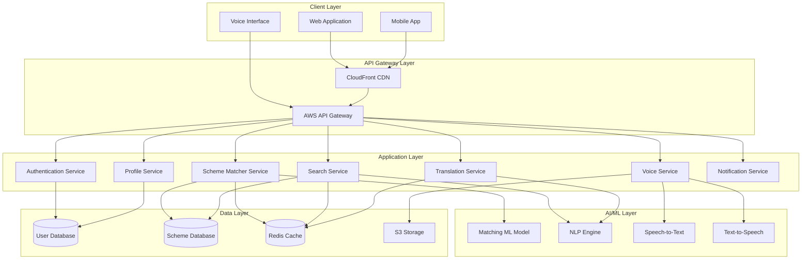

# Design Document: Sahaayak AI

## Overview

Sahaayak AI is a cloud-native, AI-powered multilingual public service assistant that helps Indian citizens discover and understand government schemes they're eligible for. The system employs a microservices architecture deployed on AWS, with AI-driven scheme matching, multilingual NLP capabilities, voice interface support, and aggressive optimization for low-bandwidth environments.

The design prioritizes accessibility, performance, and scalability to serve millions of users across diverse linguistic, literacy, and connectivity contexts.

## Architecture

### High-Level Architecture



### Architecture Principles

1. **Microservices**: Independent services for scalability and maintainability
2. **API-First**: All functionality exposed via RESTful APIs
3. **Cloud-Native**: Leverages AWS managed services for reliability
4. **Caching Strategy**: Aggressive caching for performance and bandwidth optimization
5. **Async Processing**: Non-blocking operations for better user experience
6. **Multi-Region**: Deployed across multiple AWS regions for low latency

### Technology Stack

- **Frontend**: React.js with Progressive Web App (PWA) capabilities
- **API Gateway**: AWS API Gateway with request throttling and caching
- **Backend Services**: Node.js with Express.js (for I/O-bound operations)
- **ML Services**: Python with FastAPI (for AI/ML workloads)
- **Databases**: 
  - Amazon RDS PostgreSQL (user profiles, transactional data)
  - Amazon DynamoDB (scheme database, high-read workload)
- **Caching**: Amazon ElastiCache (Redis)
- **Storage**: Amazon S3 (voice recordings, static assets)
- **CDN**: Amazon CloudFront (global content delivery)
- **ML Platform**: Amazon SageMaker (model training and deployment)
- **Voice Services**: Amazon Polly (TTS), Amazon Transcribe (STT)
- **Translation**: Amazon Translate with custom terminology
- **Monitoring**: Amazon CloudWatch, AWS X-Ray
- **Authentication**: AWS Cognito with OTP via Amazon SNS

## Components and Interfaces

### 1. Authentication Service

**Responsibility**: User registration, login, session management, and authorization.

**Interfaces**:

```typescript
interface AuthService {
  // Register new user with mobile number
  registerUser(mobileNumber: string, language: string): Promise<{userId: string, otpSent: boolean}>
  
  // Verify OTP and complete registration
  verifyOTP(userId: string, otp: string): Promise<{token: string, expiresAt: number}>
  
  // Login with mobile number
  login(mobileNumber: string): Promise<{otpSent: boolean}>
  
  // Verify login OTP
  verifyLoginOTP(mobileNumber: string, otp: string): Promise<{token: string, userId: string}>
  
  // Refresh authentication token
  refreshToken(token: string): Promise<{newToken: string, expiresAt: number}>
  
  // Logout and invalidate session
  logout(token: string): Promise<{success: boolean}>
  
  // Validate token for authorization
  validateToken(token: string): Promise<{valid: boolean, userId: string}>
}
```

**Implementation Details**:
- Uses AWS Cognito for user pool management
- OTP delivery via Amazon SNS
- JWT tokens with 30-minute expiration
- Failed login attempts tracked in Redis with 15-minute lockout after 3 failures
- Session data stored in Redis for fast validation

### 2. Profile Service

**Responsibility**: Manage user profile data including demographics and preferences.

**Interfaces**:

```typescript
interface UserProfile {
  userId: string
  mobileNumber: string
  age: number
  gender: 'male' | 'female' | 'other'
  state: string
  district: string
  annualIncome: number
  occupation: string
  category: 'general' | 'obc' | 'sc' | 'st' | 'ews'
  householdSize: number
  hasDisability: boolean
  preferredLanguage: string
  notificationPreferences: NotificationPreferences
  createdAt: Date
  updatedAt: Date
}

interface NotificationPreferences {
  smsEnabled: boolean
  emailEnabled: boolean
  inAppEnabled: boolean
  frequency: 'immediate' | 'daily' | 'weekly'
}

interface ProfileService {
  // Create new user profile
  createProfile(userId: string, profile: Partial<UserProfile>): Promise<UserProfile>
  
  // Get user profile by ID
  getProfile(userId: string): Promise<UserProfile>
  
  // Update user profile
  updateProfile(userId: string, updates: Partial<UserProfile>): Promise<UserProfile>
  
  // Delete user profile and all associated data
  deleteProfile(userId: string): Promise<{success: boolean}>
  
  // Validate profile data against constraints
  validateProfileData(profile: Partial<UserProfile>): Promise<{valid: boolean, errors: string[]}>
}
```

**Implementation Details**:
- Stores data in Amazon RDS PostgreSQL with encryption at rest
- Profile data encrypted using AES-256
- Implements data validation rules (age 0-120, income >= 0, etc.)
- Audit log for all profile changes stored separately
- Supports partial updates to minimize data transfer

### 3. Scheme Matcher Service

**Responsibility**: AI-powered matching of users to eligible government schemes.

**Interfaces**:

```typescript
interface SchemeMatch {
  schemeId: string
  schemeName: string
  confidenceScore: number // 0-100
  eligibilityStatus: 'eligible' | 'partially_eligible' | 'not_eligible'
  matchReasons: string[]
  estimatedBenefit: number
  priority: number
}

interface MatcherService {
  // Find matching schemes for a user profile
  findMatches(userId: string): Promise<SchemeMatch[]>
  
  // Get detailed match explanation
  getMatchExplanation(userId: string, schemeId: string): Promise<{
    eligible: boolean
    matchedCriteria: string[]
    unmatchedCriteria: string[]
    missingDocuments: string[]
  }>
  
  // Suggest profile improvements for better matches
  suggestProfileImprovements(userId: string): Promise<{
    suggestions: string[]
    potentialNewMatches: number
  }>
  
  // Re-rank matches based on user preferences
  rankMatches(matches: SchemeMatch[], preferences: RankingPreferences): SchemeMatch[]
}

interface RankingPreferences {
  prioritizeBenefit: boolean
  preferredCategories: string[]
  urgencyLevel: 'high' | 'medium' | 'low'
}
```

**Implementation Details**:
- ML model trained on historical scheme eligibility data
- Feature engineering from user profile: age_group, income_bracket, location_tier, etc.
- Model: Gradient Boosting (XGBoost) for classification
- Features: 25+ engineered features from profile and scheme criteria
- Model deployed on Amazon SageMaker with auto-scaling
- Confidence score based on model probability and rule-based validation
- Results cached in Redis for 24 hours per user
- Batch inference for multiple schemes in single API call

**Matching Algorithm**:
1. Extract user features from profile
2. Query all active schemes from database
3. Run ML model inference for each scheme
4. Apply rule-based filters for hard constraints (age limits, location, etc.)
5. Calculate confidence scores combining ML probability and rule matches
6. Rank by confidence score and estimated benefit
7. Return top N matches (default: 20)

### 4. Search Service

**Responsibility**: Keyword-based scheme search with multilingual support.

**Interfaces**:

```typescript
interface SearchResult {
  schemeId: string
  schemeName: string
  description: string
  relevanceScore: number
  highlights: string[]
}

interface SearchService {
  // Search schemes by keywords
  searchSchemes(query: string, language: string, filters?: SearchFilters): Promise<SearchResult[]>
  
  // Get search suggestions as user types
  getSuggestions(partialQuery: string, language: string): Promise<string[]>
  
  // Get related schemes
  getRelatedSchemes(schemeId: string, limit: number): Promise<SearchResult[]>
}

interface SearchFilters {
  category?: string[]
  benefitType?: string[]
  targetDemographic?: string[]
  state?: string
}
```

**Implementation Details**:
- Uses Amazon OpenSearch Service for full-text search
- Multilingual search with language-specific analyzers
- Synonym expansion for common terms (e.g., "farmer" → "किसान", "ryot")
- TF-IDF scoring with boosting for scheme name matches
- Search index updated every hour from scheme database
- Query results cached in Redis for 1 hour
- Automatic language detection using character set analysis

### 5. Translation Service

**Responsibility**: Translate content between supported languages.

**Interfaces**:

```typescript
interface TranslationService {
  // Translate text to target language
  translate(text: string, targetLanguage: string, sourceLanguage?: string): Promise<string>
  
  // Batch translate multiple texts
  batchTranslate(texts: string[], targetLanguage: string): Promise<string[]>
  
  // Translate with terminology preservation
  translateWithTerms(text: string, targetLanguage: string, preserveTerms: string[]): Promise<string>
  
  // Detect language of text
  detectLanguage(text: string): Promise<string>
}
```

**Implementation Details**:
- Uses Amazon Translate with custom terminology
- Custom terminology for government scheme names and technical terms
- Translation cache in Redis (key: hash of text + target language)
- Cache TTL: 7 days for scheme content, 1 day for UI text
- Fallback to English if translation fails
- Preserves formatting and special characters

### 6. Voice Service

**Responsibility**: Speech-to-text and text-to-speech conversion.

**Interfaces**:

```typescript
interface VoiceService {
  // Convert speech to text
  speechToText(audioData: Buffer, language: string): Promise<{
    text: string
    confidence: number
  }>
  
  // Convert text to speech
  textToSpeech(text: string, language: string, voiceGender?: 'male' | 'female'): Promise<{
    audioUrl: string
    duration: number
  }>
  
  // Process voice command
  processVoiceCommand(audioData: Buffer, language: string): Promise<{
    command: string
    parameters: Record<string, any>
  }>
}
```

**Implementation Details**:
- Amazon Transcribe for STT with language-specific models
- Amazon Polly for TTS with neural voices
- Audio files stored in S3 with 24-hour expiration
- Streaming support for real-time voice interaction
- Voice command parser for navigation ("next", "back", "repeat", "help")
- Minimum 85% confidence threshold for STT acceptance
- Audio compression (Opus codec) for bandwidth optimization

### 7. Notification Service

**Responsibility**: Send notifications via multiple channels.

**Interfaces**:

```typescript
interface NotificationService {
  // Send notification to user
  sendNotification(userId: string, notification: Notification): Promise<{sent: boolean}>
  
  // Send bulk notifications
  sendBulkNotifications(userIds: string[], notification: Notification): Promise<{
    sent: number
    failed: number
  }>
  
  // Schedule notification for future delivery
  scheduleNotification(userId: string, notification: Notification, sendAt: Date): Promise<{
    notificationId: string
  }>
  
  // Get notification history
  getNotificationHistory(userId: string, limit: number): Promise<Notification[]>
}

interface Notification {
  type: 'new_scheme' | 'deadline_reminder' | 'eligibility_change' | 'system_update'
  title: string
  message: string
  channels: ('sms' | 'email' | 'in_app')[]
  priority: 'high' | 'medium' | 'low'
  actionUrl?: string
}
```

**Implementation Details**:
- Amazon SNS for SMS delivery
- Amazon SES for email delivery
- In-app notifications stored in DynamoDB
- Respects user notification preferences
- Rate limiting: max 5 notifications per day per user
- Scheduled notifications using Amazon EventBridge
- Delivery status tracking and retry logic

### 8. Scheme Database Service

**Responsibility**: Manage government scheme data.

**Interfaces**:

```typescript
interface Scheme {
  schemeId: string
  schemeName: string
  description: string
  benefits: string
  eligibilityCriteria: EligibilityCriteria
  applicationProcess: ApplicationStep[]
  requiredDocuments: string[]
  contactInfo: ContactInfo
  category: string
  benefitType: string
  targetDemographic: string[]
  state: string
  isActive: boolean
  createdAt: Date
  updatedAt: Date
}

interface EligibilityCriteria {
  minAge?: number
  maxAge?: number
  minIncome?: number
  maxIncome?: number
  allowedStates?: string[]
  allowedCategories?: string[]
  requiredOccupations?: string[]
  otherCriteria?: Record<string, any>
}

interface ApplicationStep {
  stepNumber: number
  description: string
  estimatedTime: number // minutes
  isOnline: boolean
}

interface ContactInfo {
  phone: string[]
  email: string[]
  officeAddress: string
  website?: string
}

interface SchemeService {
  // Get scheme by ID
  getScheme(schemeId: string, language?: string): Promise<Scheme>
  
  // Get all active schemes
  getAllSchemes(filters?: SchemeFilters): Promise<Scheme[]>
  
  // Create new scheme (admin only)
  createScheme(scheme: Scheme): Promise<{schemeId: string}>
  
  // Update scheme (admin only)
  updateScheme(schemeId: string, updates: Partial<Scheme>): Promise<Scheme>
  
  // Deactivate scheme (admin only)
  deactivateScheme(schemeId: string): Promise<{success: boolean}>
  
  // Bulk import schemes (admin only)
  bulkImportSchemes(schemes: Scheme[]): Promise<{
    imported: number
    failed: number
    errors: string[]
  }>
}

interface SchemeFilters {
  category?: string
  state?: string
  isActive?: boolean
}
```

**Implementation Details**:
- Stored in Amazon DynamoDB for high-read performance
- Partition key: schemeId, GSI on state and category
- Scheme content cached in Redis for 24 hours
- Version history maintained in separate table
- Admin interface for CRUD operations
- Bulk import supports CSV and JSON formats
- Validation rules for required fields and data types

## Data Models

### User Profile Data Model

```typescript
// PostgreSQL Schema
CREATE TABLE user_profiles (
  user_id UUID PRIMARY KEY,
  mobile_number VARCHAR(15) UNIQUE NOT NULL,
  age INTEGER CHECK (age >= 0 AND age <= 120),
  gender VARCHAR(10),
  state VARCHAR(50) NOT NULL,
  district VARCHAR(50) NOT NULL,
  annual_income DECIMAL(12, 2) CHECK (annual_income >= 0),
  occupation VARCHAR(100),
  category VARCHAR(20),
  household_size INTEGER CHECK (household_size > 0),
  has_disability BOOLEAN DEFAULT FALSE,
  preferred_language VARCHAR(10) DEFAULT 'en',
  notification_preferences JSONB,
  created_at TIMESTAMP DEFAULT CURRENT_TIMESTAMP,
  updated_at TIMESTAMP DEFAULT CURRENT_TIMESTAMP,
  encrypted_data BYTEA -- Additional sensitive data
);

CREATE INDEX idx_user_state ON user_profiles(state);
CREATE INDEX idx_user_category ON user_profiles(category);
CREATE INDEX idx_user_income ON user_profiles(annual_income);
```

### Scheme Data Model

```json
// DynamoDB Schema
{
  "schemeId": "string (partition key)",
  "schemeName": "string",
  "description": "string",
  "benefits": "string",
  "eligibilityCriteria": {
    "minAge": "number",
    "maxAge": "number",
    "minIncome": "number",
    "maxIncome": "number",
    "allowedStates": ["string"],
    "allowedCategories": ["string"],
    "requiredOccupations": ["string"],
    "otherCriteria": {}
  },
  "applicationProcess": [
    {
      "stepNumber": "number",
      "description": "string",
      "estimatedTime": "number",
      "isOnline": "boolean"
    }
  ],
  "requiredDocuments": ["string"],
  "contactInfo": {
    "phone": ["string"],
    "email": ["string"],
    "officeAddress": "string",
    "website": "string"
  },
  "category": "string (GSI)",
  "benefitType": "string",
  "targetDemographic": ["string"],
  "state": "string (GSI)",
  "isActive": "boolean",
  "createdAt": "string (ISO 8601)",
  "updatedAt": "string (ISO 8601)",
  "version": "number"
}
```

### Session Data Model

```typescript
// Redis Schema
interface SessionData {
  userId: string
  token: string
  expiresAt: number // Unix timestamp
  deviceInfo: {
    userAgent: string
    ipAddress: string
  }
  lastActivity: number // Unix timestamp
}

// Key pattern: session:{token}
// TTL: 30 minutes
```

### Cache Data Model

```typescript
// Redis Cache Patterns

// User matches cache
// Key: matches:{userId}
// Value: JSON array of SchemeMatch objects
// TTL: 24 hours

// Scheme cache
// Key: scheme:{schemeId}:{language}
// Value: JSON Scheme object
// TTL: 24 hours

// Translation cache
// Key: translate:{hash(text)}:{targetLang}
// Value: Translated string
// TTL: 7 days

// Search results cache
// Key: search:{hash(query)}:{language}:{filters}
// Value: JSON array of SearchResult objects
// TTL: 1 hour
```

## Low-Bandwidth Optimization Strategy

### 1. Adaptive Content Delivery

- Detect bandwidth using Network Information API
- Serve different asset bundles based on connection speed:
  - **High bandwidth (>1 Mbps)**: Full images, animations, rich media
  - **Medium bandwidth (100 kbps - 1 Mbps)**: Compressed images, minimal animations
  - **Low bandwidth (<100 kbps)**: Text-only, SVG icons, no images

### 2. Progressive Web App (PWA)

- Service worker for offline caching
- Cache-first strategy for static assets
- Network-first strategy for dynamic data with fallback to cache
- Background sync for form submissions when offline
- Maximum 50 MB cache size

### 3. Image Optimization

- WebP format with JPEG fallback
- Responsive images with srcset
- Lazy loading for below-the-fold images
- Compression levels:
  - High bandwidth: 80% quality
  - Medium bandwidth: 60% quality
  - Low bandwidth: 40% quality or placeholder
- CDN-based image transformation (CloudFront + Lambda@Edge)

### 4. Code Splitting and Lazy Loading

- Route-based code splitting
- Component-level lazy loading
- Dynamic imports for heavy features (voice, advanced search)
- Critical CSS inlined, rest loaded async
- Tree shaking to eliminate unused code

### 5. API Optimization

- GraphQL for precise data fetching (avoid over-fetching)
- Pagination with cursor-based approach
- Field selection to request only needed data
- Response compression (gzip/brotli)
- HTTP/2 for multiplexing

### 6. Data Compression

- Brotli compression for text assets (better than gzip)
- Minification of HTML, CSS, JavaScript
- JSON response compression
- Audio compression using Opus codec (voice features)

## ML Model Architecture

### Scheme Matching Model

**Model Type**: Gradient Boosting Classifier (XGBoost)

**Features** (25 total):
1. Age group (categorical: 0-18, 18-35, 35-60, 60+)
2. Income bracket (categorical: 0-1L, 1-3L, 3-5L, 5-10L, 10L+)
3. State (categorical, one-hot encoded)
4. Category (categorical: general, obc, sc, st, ews)
5. Occupation type (categorical: farmer, student, employed, self-employed, unemployed)
6. Household size (numerical)
7. Has disability (binary)
8. Gender (categorical)
9. Urban/rural (derived from district)
10. Age match score (numerical: how well age fits scheme criteria)
11. Income match score (numerical: how well income fits scheme criteria)
12. Location match score (numerical: state/district match)
13. Category match score (numerical: category eligibility)
14. Occupation match score (numerical: occupation relevance)
15-25. Scheme-specific features (benefit amount, application complexity, etc.)

**Training Data**:
- Historical application data (approved/rejected)
- Synthetic data generated from eligibility rules
- Minimum 100,000 samples per scheme category
- Balanced dataset with oversampling for minority classes

**Model Performance Targets**:
- Precision: >85% (minimize false positives)
- Recall: >90% (minimize false negatives - don't miss eligible schemes)
- F1 Score: >87%
- Inference time: <100ms per scheme

**Model Deployment**:
- Hosted on Amazon SageMaker
- A/B testing for model updates
- Model versioning and rollback capability
- Monitoring for model drift
- Retraining monthly with new data

### NLP for Search

**Approach**: Multilingual embeddings + keyword matching

**Components**:
1. **Tokenization**: Language-specific tokenizers
2. **Embeddings**: Multilingual BERT (mBERT) for semantic search
3. **Keyword Matching**: BM25 algorithm for exact matches
4. **Hybrid Scoring**: Combine semantic similarity (40%) + keyword match (60%)

**Implementation**:
- Pre-computed embeddings for all schemes stored in vector database
- Query embedding computed at search time
- Cosine similarity for semantic matching
- Results merged and re-ranked


## Correctness Properties

A property is a characteristic or behavior that should hold true across all valid executions of a system—essentially, a formal statement about what the system should do. Properties serve as the bridge between human-readable specifications and machine-verifiable correctness guarantees.

### Property 1: Profile Data Collection Completeness

*For any* user profile creation request, all required fields (age, income, location, occupation, household composition) should be present in the stored profile data.

**Validates: Requirements 1.1**

### Property 2: Profile Validation Enforcement

*For any* profile update with invalid data (age outside 0-120, negative income, empty required fields), the validation should reject the update and return specific error messages for each constraint violation.

**Validates: Requirements 1.2**

### Property 3: Profile CRUD Operations

*For any* user profile, retrieving and then updating it should succeed, and the updated values should be reflected in subsequent retrievals.

**Validates: Requirements 1.5**

### Property 4: Scheme Matching Considers All Attributes

*For any* user profile, the scheme matcher should evaluate all profile attributes (age, income, location, occupation, category, household size, disability status) when generating matches.

**Validates: Requirements 2.1**

### Property 5: Match Results Ranking

*For any* set of matched schemes, the results should be ordered in descending order by a combination of confidence score and benefit value, with higher-scoring schemes appearing first.

**Validates: Requirements 2.2, 2.4**

### Property 6: Confidence Score Range

*For any* scheme match result, the confidence score should be a number between 0 and 100 inclusive.

**Validates: Requirements 2.3**

### Property 7: Language Selection Propagation

*For any* language selection change, all subsequent UI elements and content should be displayed in the newly selected language.

**Validates: Requirements 3.2, 3.4**

### Property 8: Scheme Name Translation Format

*For any* translated scheme name, the output should contain both the translated name and the original name in parentheses.

**Validates: Requirements 3.5**

### Property 9: Low-Bandwidth Image Compression

*For any* image served in low-bandwidth mode, the file size should be reduced by at least 70% compared to the standard version.

**Validates: Requirements 5.2**

### Property 10: Scheme Caching Behavior

*For any* scheme accessed by a user, subsequent requests for the same scheme should be served from cache when available.

**Validates: Requirements 5.4**

### Property 11: Scheme Information Completeness

*For any* scheme retrieved by ID, the response should include all required fields: scheme name, description, benefits, eligibility criteria, application process steps, required documents, and contact information.

**Validates: Requirements 6.1, 6.4, 8.2, 8.4**

### Property 12: Reading Level Compliance

*For any* scheme description text, the Flesch-Kincaid grade level should be 8.0 or lower, ensuring accessibility for users with basic literacy.

**Validates: Requirements 6.2**

### Property 13: Monetary Value Formatting

*For any* scheme benefit containing a monetary value, the displayed text should include the "₹" symbol and be formatted as Indian Rupees.

**Validates: Requirements 6.3**

### Property 14: Eligibility Criteria Evaluation

*For any* eligibility check request, all scheme criteria (age range, income range, location, category, occupation) should be compared against the user profile.

**Validates: Requirements 7.1**

### Property 15: Application Steps Completeness

*For any* scheme's application guidance, each step should have a step number, description, and estimated time in minutes.

**Validates: Requirements 8.1, 8.3**

### Property 16: Deadline Display with Countdown

*For any* scheme with an application deadline, the displayed information should include both the deadline date and a countdown indicator showing days remaining.

**Validates: Requirements 8.5**

### Property 17: ARIA Labels for Interactive Elements

*For any* interactive UI element (buttons, links, form inputs), the rendered HTML should include appropriate ARIA labels or aria-label attributes.

**Validates: Requirements 9.1**

### Property 18: Keyboard Navigation Support

*For any* interactive element in the UI, it should be reachable and operable using only keyboard navigation (Tab, Enter, Space, Arrow keys).

**Validates: Requirements 9.2**

### Property 19: Color Contrast Compliance

*For any* text element in the UI, the contrast ratio between text color and background color should be at least 4.5:1 for normal text or 3:1 for large text (18pt+).

**Validates: Requirements 9.3**

### Property 20: Alt Text for Informational Images

*For any* image that conveys information (not decorative), the img element should have a non-empty alt attribute with descriptive text.

**Validates: Requirements 9.5**

### Property 21: Role-Based Access Control

*For any* administrative function endpoint, requests from non-admin users should be rejected with a 403 Forbidden status code.

**Validates: Requirements 11.3**

### Property 22: Audit Logging for Profile Access

*For any* user profile read or write operation, an audit log entry should be created containing timestamp, user ID, operation type, and accessor identity.

**Validates: Requirements 11.5**

### Property 23: Error Messages in User Language

*For any* error that occurs during user interaction, the error message displayed should be in the user's selected language.

**Validates: Requirements 13.1**

### Property 24: Error Logging Without PII

*For any* error logged to the system, the log entry should contain sufficient debugging information (error type, stack trace, context) but should not contain personally identifiable information (names, phone numbers, addresses).

**Validates: Requirements 13.5**

### Property 25: Scheme Validation on Creation

*For any* scheme creation request, all required fields (scheme name, description, eligibility criteria, application process) should be validated, and requests with missing fields should be rejected.

**Validates: Requirements 15.2**

### Property 26: Scheme Version History

*For any* scheme update operation, a new version entry should be created in the version history table with the previous values and timestamp.

**Validates: Requirements 15.3**

### Property 27: Bulk Import Processing

*For any* bulk import file (CSV or JSON) containing N valid schemes, the import operation should successfully create N scheme records in the database.

**Validates: Requirements 15.5**

### Property 28: Analytics Event Tracking

*For any* user action (search, scheme view, eligibility check), an analytics event should be logged with event type, timestamp, user ID, and relevant parameters.

**Validates: Requirements 16.1**

### Property 29: Icon Label Presence

*For any* icon used for navigation or actions, it should be accompanied by a visible text label or tooltip.

**Validates: Requirements 17.2**

### Property 30: Help Button Availability

*For any* page or screen in the application, a help button should be present and accessible.

**Validates: Requirements 17.5**

### Property 31: Multilingual Search Support

*For any* search query in a supported language (Hindi, English, Tamil, Telugu, Bengali, Marathi, Gujarati, Kannada, Malayalam, Punjabi), the search should return relevant results.

**Validates: Requirements 18.2**

### Property 32: Search Term Highlighting

*For any* search result, the query terms should be highlighted or emphasized in the displayed scheme name and description.

**Validates: Requirements 18.4**

### Property 33: Search Filters Application

*For any* search with filters applied (category, benefit type, demographic), all returned results should match the specified filter criteria.

**Validates: Requirements 18.5**

### Property 34: Conditional Notification Delivery

*For any* user with notification preferences enabled, when a new scheme matching their profile is added or their eligibility status changes, a notification should be sent via their preferred channels.

**Validates: Requirements 19.1, 19.5**

### Property 35: Notification Preference Updates

*For any* notification preference change (frequency, channels), subsequent notifications should respect the updated preferences.

**Validates: Requirements 19.4**

### Property 36: Top Schemes Offline Caching

*For any* user, their top 10 matched schemes should be cached locally and accessible when the device is offline.

**Validates: Requirements 20.2**

### Property 37: Offline Sync on Reconnection

*For any* pending actions queued while offline (profile updates, searches), when connectivity is restored, these actions should be automatically synchronized with the server.

**Validates: Requirements 20.4**

### Property 38: Offline Storage Limit

*For any* device with the application installed, the total offline cache storage should not exceed 50 MB.

**Validates: Requirements 20.5**

## Error Handling

### Error Categories

1. **Validation Errors**: Invalid input data (400 Bad Request)
2. **Authentication Errors**: Invalid or expired tokens (401 Unauthorized)
3. **Authorization Errors**: Insufficient permissions (403 Forbidden)
4. **Not Found Errors**: Resource doesn't exist (404 Not Found)
5. **Rate Limiting Errors**: Too many requests (429 Too Many Requests)
6. **Server Errors**: Internal failures (500 Internal Server Error)
7. **Service Unavailable**: Dependency failures (503 Service Unavailable)

### Error Response Format

```typescript
interface ErrorResponse {
  error: {
    code: string // Machine-readable error code
    message: string // User-friendly message in selected language
    details?: Record<string, any> // Additional context
    requestId: string // For support and debugging
    timestamp: number // Unix timestamp
  }
}
```

### Error Handling Strategies

**1. Input Validation Errors**
- Validate all inputs at API gateway level
- Return specific field-level errors
- Provide suggestions for correction
- Example: "Age must be between 0 and 120"

**2. Authentication Failures**
- Clear error messages without revealing security details
- Implement exponential backoff for repeated failures
- Account lockout after 3 failed attempts (15 minutes)
- Send security notifications for suspicious activity

**3. Service Degradation**
- Graceful degradation when dependencies fail
- Serve cached data when possible
- Display clear status messages to users
- Automatic retry with exponential backoff

**4. Network Errors**
- Detect offline state and enable offline mode
- Queue actions for later sync
- Provide clear offline indicators
- Auto-sync when connectivity restored

**5. Voice Recognition Failures**
- Confidence threshold: 85% for acceptance
- Below threshold: prompt for retry
- After 3 failures: offer text input alternative
- Provide clearer instructions with each retry

**6. Translation Failures**
- Fallback to English if translation unavailable
- Cache successful translations
- Log failures for manual review
- Display original text with language indicator

**7. ML Model Errors**
- Fallback to rule-based matching if ML fails
- Log model errors for retraining
- Graceful degradation with reduced confidence scores
- Monitor model performance metrics

### Logging Strategy

**Log Levels**:
- **ERROR**: System failures requiring immediate attention
- **WARN**: Degraded functionality, potential issues
- **INFO**: Normal operations, audit events
- **DEBUG**: Detailed diagnostic information

**Logged Information**:
- Request ID for tracing
- User ID (hashed for privacy)
- Timestamp with timezone
- Error type and message
- Stack trace (for errors)
- Request parameters (sanitized)
- Response time
- Service dependencies involved

**PII Protection**:
- Never log passwords, tokens, or OTPs
- Hash user IDs and mobile numbers
- Redact sensitive profile data
- Use tokenization for payment information

## Testing Strategy

### Dual Testing Approach

The testing strategy employs both unit tests and property-based tests to ensure comprehensive coverage:

- **Unit tests**: Verify specific examples, edge cases, error conditions, and integration points
- **Property-based tests**: Verify universal properties across randomly generated inputs

Both approaches are complementary and necessary for high-confidence correctness.

### Property-Based Testing

**Framework**: fast-check (for JavaScript/TypeScript services)

**Configuration**:
- Minimum 100 iterations per property test
- Seed-based reproducibility for failed tests
- Shrinking enabled to find minimal failing cases
- Timeout: 30 seconds per property

**Test Organization**:
Each property test must:
1. Reference its design document property number
2. Use the tag format: `Feature: sahaayak-ai, Property N: [property description]`
3. Generate diverse random inputs covering edge cases
4. Assert the property holds for all generated inputs

**Example Property Test Structure**:

```typescript
// Feature: sahaayak-ai, Property 6: Confidence Score Range
describe('Scheme Matcher Properties', () => {
  it('should return confidence scores between 0 and 100', async () => {
    await fc.assert(
      fc.asyncProperty(
        userProfileArbitrary(),
        async (profile) => {
          const matches = await schemeMatcher.findMatches(profile.userId);
          return matches.every(match => 
            match.confidenceScore >= 0 && match.confidenceScore <= 100
          );
        }
      ),
      { numRuns: 100 }
    );
  });
});
```

**Generators (Arbitraries)**:

Create generators for:
- User profiles with valid and edge-case values
- Scheme data with various eligibility criteria
- Search queries in multiple languages
- Network conditions (bandwidth, latency)
- Error scenarios

### Unit Testing

**Framework**: Jest (for JavaScript/TypeScript)

**Focus Areas**:
1. **Specific Examples**: Test known inputs and expected outputs
2. **Edge Cases**: Empty inputs, boundary values, special characters
3. **Error Conditions**: Invalid inputs, service failures, timeouts
4. **Integration Points**: API contracts, database queries, external services

**Coverage Targets**:
- Line coverage: >80%
- Branch coverage: >75%
- Function coverage: >85%

**Example Unit Test**:

```typescript
describe('Profile Service', () => {
  it('should reject profile with age > 120', async () => {
    const invalidProfile = { age: 150, income: 50000, state: 'Karnataka' };
    await expect(profileService.createProfile('user123', invalidProfile))
      .rejects
      .toThrow('Age must be between 0 and 120');
  });
});
```

### Integration Testing

**Scope**: Test interactions between services

**Test Scenarios**:
1. End-to-end user flows (registration → profile → matching → eligibility)
2. Service-to-service communication
3. Database transactions and rollbacks
4. Cache invalidation and updates
5. Authentication and authorization flows

**Tools**:
- Supertest for API testing
- Testcontainers for database testing
- AWS LocalStack for cloud service mocking

### Performance Testing

**Tools**: Apache JMeter, Artillery

**Test Scenarios**:
1. Load testing: 10,000 concurrent users
2. Stress testing: Gradual load increase to breaking point
3. Spike testing: Sudden traffic surges
4. Endurance testing: Sustained load over 24 hours

**Performance Targets**:
- API response time: p95 < 3 seconds
- Database query time: p95 < 500ms
- Page load time: p95 < 2 seconds (first contentful paint)
- Throughput: 1000 requests/second per service

### Accessibility Testing

**Tools**:
- axe-core for automated accessibility testing
- WAVE browser extension
- Manual testing with screen readers (NVDA, JAWS)

**Test Coverage**:
- WCAG 2.1 Level AA compliance
- Keyboard navigation
- Screen reader compatibility
- Color contrast
- Text resizing
- Focus management

### Security Testing

**Approaches**:
1. **Static Analysis**: SonarQube, ESLint security plugins
2. **Dependency Scanning**: npm audit, Snyk
3. **Penetration Testing**: OWASP ZAP, Burp Suite
4. **Authentication Testing**: Token validation, session management
5. **Authorization Testing**: Role-based access control

**Security Checklist**:
- SQL injection prevention
- XSS protection
- CSRF tokens
- Rate limiting
- Input sanitization
- Secure headers (CSP, HSTS)
- Encryption at rest and in transit

### Multilingual Testing

**Test Coverage**:
- UI translation completeness for all 10 languages
- Text rendering (RTL for Urdu if added)
- Character encoding (UTF-8)
- Date/time formatting
- Number formatting (Indian numbering system)
- Voice input/output for each language

**Approach**:
- Automated tests for translation key coverage
- Manual review by native speakers
- Pseudo-localization for layout testing

### Monitoring and Observability

**Metrics to Track**:
1. **Application Metrics**:
   - Request rate, error rate, latency (RED metrics)
   - Active users, session duration
   - Feature usage (searches, matches, eligibility checks)

2. **Business Metrics**:
   - Scheme discovery rate
   - Application completion rate
   - User retention
   - Language distribution

3. **Infrastructure Metrics**:
   - CPU, memory, disk usage
   - Database connections, query performance
   - Cache hit rate
   - API gateway throttling

**Tools**:
- Amazon CloudWatch for metrics and logs
- AWS X-Ray for distributed tracing
- Custom dashboards for business metrics
- PagerDuty for alerting

**Alerting Thresholds**:
- Error rate > 1%
- API latency p95 > 5 seconds
- Database query time p95 > 1 second
- Cache hit rate < 70%
- Service availability < 99.5%

### Continuous Integration/Continuous Deployment

**CI Pipeline**:
1. Code checkout
2. Dependency installation
3. Linting and formatting checks
4. Unit tests
5. Property-based tests
6. Integration tests
7. Security scanning
8. Build artifacts
9. Deploy to staging

**CD Pipeline**:
1. Smoke tests on staging
2. Performance tests
3. Manual approval gate
4. Blue-green deployment to production
5. Health checks
6. Gradual traffic shift
7. Rollback on errors

**Deployment Strategy**:
- Blue-green deployment for zero downtime
- Canary releases for gradual rollout
- Feature flags for controlled feature releases
- Automated rollback on health check failures

